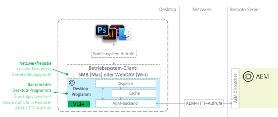

# Best Practices für das AEM-Desktop-Programm, v1.x {#aem-desktop-app-best-practices}

## Überblick {#overview}

Das Adobe Experience Manager (AEM)-Desktop-Programm verknüpft Ihre Digital-Asset-Management-Lösung (DAM) mit dem Desktop, damit Sie in der AEM-Web-Benutzeroberfläche verfügbare Dateien direkt auf dem Desktop öffnen können. Wenn Sie ein Asset vom Desktop aus speichern, wird es in den entsprechenden Speicherort in AEM hochgeladen.

Das AEM-Desktop-Programm verhindert auf diese Weise, dass die falschen lokalen Kopien oder die falschen Assets in AEM aktualisiert werden. Der benutzerfreundliche Workflow des Desktop-Programms wird mithilfe der Netzwerkfreigabetechnologie aktiviert, die von Desktop-Betriebssystemen bereitgestellt wird.

Das Desktop-Programm stellt das AEM Assets-Repository als Netzwerkfreigabe auf dem Desktop bereit. Daher sieht es so aus, als handle es sich um lokale Ordner und Dateien. Es wird jedoch nicht empfohlen, Digital Asset Management-Vorgänge direkt über den Desktop in der bereitgestellten Netzwerkfreigabe in Finder oder Explorer durchzuführen. Vielmehr empfiehlt Adobe, dass Sie Vorgänge wie das Kopieren oder Verschieben einer großen Anzahl von Assets über die AEM Assets-Web-Benutzeroberfläche abwickeln.

>[!NOTE]
>
>Vor der Lektüre dieses Dokuments können Sie sich die allgemeinen [Best Practices zur AEM- und Creative Cloud-Integration](https://docs.adobe.com/content/help/de-DE/experience-manager-64/assets/administer/aem-cc-integration-best-practices.html) durchlesen, wenn Sie sich zunächst einen Überblick über dieses Thema verschaffen möchten.

## Architektur des AEM-Desktop-Programms {#aem-desktop-app-architecture}

Das AEM-Desktop-Programm stellt Netzwerkfreigaben über WebDAV (Windows) oder SMB (Mac) bereit. Die bereitgestellte Netzwerkfreigabe liegt ausschließlich lokal vor. Das AEM-Desktop-Programm fängt die Aufrufe (Öffnen, Lesen, Schreiben) ab und bietet zusätzliches lokales Caching. Das Programm übersetzt Remote-Aufrufe an den AEM Assets-Server in optimierte AEM-HTTP-Anforderungen. Die folgende Abbildung zeigt die Architektur des AEM-Desktop-Programms.

*Abbildung: Desktop-App-Architektur*

Das zusätzliche Caching bei Schreibvorgängen führt, wenn eine Datei gespeichert wird, dazu, dass die Datei zunächst lokal gespeichert wird (sodass der Benutzer nicht auf die Netzwerkübertragung warten muss). Dann nach einer vordefinierten Verzögerung (30 Sek.) wird zunächst die Datei im Hintergrund in AEM hochgeladen, dann auch das Asset. Das AEM-Desktop-Programm verfügt über eine Benutzeroberfläche zum Überwachen des Status von Datei-Uploads im Hintergrund.

## Verwendungsempfehlung für das AEM-Desktop-Programm {#recommended-use-of-aem-desktop-app}

Zu den Hauptfunktionen und -merkmalen des AEM-Desktop-Programms gehören u. a.:

* **Öffnen von Dateien über die Web-Benutzeroberfläche von AEM Assets auf dem Desktop**. Über die Web-Benutzeroberfläche können Sie Assets auf dem Desktop (im Finder, Explorer) anzeigen oder ein Asset mit einer Desktop-Anwendung öffnen.

* **Checkout und Check-in**. Assets können zur Bearbeitung ausgecheckt werden, sie werden in AEM Assets als gesperrt markiert. Nach dem Bearbeiten können die Assets dann wieder eingecheckt und damit entsperrt werden.

* **Speichern Sie die Änderungen an den Dateien**. Jede Änderung, die Sie in der Netzwerkfreigabe speichern, wird automatisch in AEM hochgeladen und eine neue Version wird erstellt.

* **Platzieren Sie verknüpfte Assets in anderen Dokumenten**. In Anwendungen wie Creative Cloud ([!DNL Adobe Photoshop], [!DNL Adobe InDesign]und [!DNL Adobe Illustrator]) können Sie eine externe Datei als Link platzieren. Sie können beispielsweise ein Bild in einem InDesign-Dokument platzieren. In diesem Fall können Sie mit der bereitgestellten Netzwerkfreigabe Assets aus AEM zur Platzierung durchsuchen und auswählen. Verknüpfte Dateien können auch in Adobe-fremden Applikationen wie MS Office platziert werden.

* **Referenzauflösung in AEM**. Wenn sowohl die platzierten Dateien als auch die Hauptdateien mit Link in gespeichert sind, können AEM automatisch serverseitige Informationen zu den Asset-Verweisen bereitstellen.

* **Greifen Sie vom Desktop** auf das Asset zu. In the mounted network share, a contextual menu provides a [!UICONTROL More Info] dialog (larger preview, key metadata) and the ability to open an asset in the AEM UI.

* **Hochladen großer, hierarchischer Ordner als Massendatei**. Wenn Sie die Option &quot;Erstellen&quot;> &quot;Ordner hochladen&quot;in AEM Benutzeroberfläche verwenden, um Assets hochzuladen, lädt AEM Desktop-App die ausgewählte Ordnerhierarchie hoch, um sie im Hintergrund zu AEM. Der Upload-Fortschritt kann über eine dedizierte Benutzeroberfläche im AEM-Desktop-Programm überwacht werden.

## Unsachgemäße Verwendung des AEM-Desktop-Programms {#inappropriate-use-of-aem-desktop-app}

* Setzen Sie das AEM-Desktop-Programm nicht ein, um Assets über den Desktop zu verwalten. Das AEM-Desktop-Programm wurde nicht als Ersatz für Netzlaufwerke entwickelt. Verwenden Sie stattdessen die folgenden Funktionen:

   * AEM Assets-Web-Benutzeroberfläche für die digitale Asset-Verwaltung (Suchen oder Freigeben von Assets, Metadaten und Kopieren oder Verschieben).

   * AEM desktop app [!UICONTROL Folder Upload] to upload large, hierarchical folders.

* Behandeln Sie das AEM-Desktop-Programm nicht als Client zur Desktop-Synchronisierung für AEM Assets. Der Hauptvorteil des AEM-Desktop-Programms besteht hier darin, dass sie einen „virtuellen“ Zugriff auf das gesamte Repository ermöglicht, während Applikationen zur Desktop-Synchronisierung normalerweise nur die Assets synchronisieren, die dem jeweiligen Benutzer gehören. Das AEM-Desktop-Programm bietet gewisse Caching-Möglichkeiten und Hintergrund-Uploads; dennoch unterscheidet sich die Funktionsweise stark von typischen Synchronisierungsapplikationen wie der Adobe Creative Cloud-Desktop-Applikation oder Microsoft OneDrive.

* Setzen Sie AEM-Desktop-Programm-Netzlaufwerke nicht zum regelmäßigen Speichern von Assets ein. Alle Speichervorgänge werden an AEM Assets übertragen. Daher ist es unpraktisch, intensive Bearbeitungsvorgänge direkt in dem bereitgestellten AEM Assets-Repository durchzuführen. Wird ein Asset direkt im bereitgestellten Repository bearbeitet, wird die Zeitleiste des Assets mit irrelevanten Versionen „vollgestopft“ und der Server wird durch Mehraufwand belastet.

* Setzen Sie das AEM-Desktop-Programm nicht ein, um große Datenmengen von einer AEM-Instanz zu einer anderen zu migrieren. Informationen zum Planen und Ausführen von Asset-Migrationen finden Sie im [Migrationshandbuch](https://docs.adobe.com/content/help/de-DE/experience-manager-65/assets/administer/assets-migration-guide.html). In contrast, desktop app [supports bulk uploading](use-app-v1.md#bulkupload) large number of assets for the first time in [!DNL Adobe Experience Manager].

## Empfehlungen für ausgewählte Anwendungsfälle{#recommendations-for-selected-use-cases}

### Asset-Zugriff für kreative Benutzer {#access-to-assets-for-creative-users}

Das AEM-Desktop-Programm ermöglicht einen virtuellen Zugriff auf das gesamte DAM-Repository. Dabei kann es sich für kreative Benutzer als schwierig herausstellen, die richtigen Assets zu finden und auf diese über ihren Desktop zuzugreifen. Wenden Sie diese Best Practices an, um diesen Vorgang für kreative Benutzer zu vereinfachen.

* Setzen Sie Collaboration-Funktionen in der AEM Assets-Web-Benutzeroberfläche ein, um kreativen Benutzern einen direkteren Zugang zu den richtigen Assets zu ermöglichen. Hierzu gehören etwa die Freigabe von Ordnern oder Sammlungen, die Bereitstellung von Smart-Sammlungen (gespeicherten Suchen) oder der Versand von Benachrichtigungen mit Verweisen zu den richtigen Assets. Kreative Benutzer können dann auf ihrem Desktop mithilfe der Desktop-Aktionen der Web-Benutzeroberfläche schnell auf diese Assets zugreifen.

* Berücksichtigen Sie die richtigen Berechtigungen für Assets (Zugriffskontrolle), um die Ansicht in das DAM-Repository für die kreativen Benutzer zu vereinfachen und im Grunde den Zugriff auf Assets zu beschränken, die sie benötigen oder an denen sie interessiert sind:

   * Bestimmte Bereiche, die für die Kreativanwender nicht relevant sind, können für ihre Benutzergruppen verweigert werden, um sie aus ihrer Ansicht zu entfernen, auch auf dem Desktop.

   * Die meisten Assets in DAM sind endgültig und nicht für Änderungen vorgesehen - diese sollten für die kreativen Benutzer schreibgeschützt sein.

   * Nur Assets, die Änderungen oder Retuschieren erfordern, sollten für die kreativen Benutzer schreibgeschützt sein. Manche Unternehmen nutzen AEM-Projekte und die von ihnen erstellten Ordner zum Hosten von Assets, die noch Änderungen unterworfen sind.

### Suchen nach Assets    {#searching-assets}

So suchen Sie nach einer Datei, die Sie auf dem Desktop öffnen möchten:

* Suchen Sie mithilfe der AEM Assets-Web-Benutzeroberfläche nach dem Asset. Suchvorgänge        in AEM Assets sind nicht nur leistungsstark (Suchfacetten, gespeicherte Suchen), sie bieten darüber hinaus zusätzliche Funktionen zum Auffinden des richtigen Assets. Dazu gehören zusätzliche Filter wie die Suche nach Assets basierend auf dem Status (Genehmigung, Ablauf), Sammlungen, Aufgaben, Benachrichtigungen und Freigeben von Ordnern/Sammlungen für andere Benutzer/Gruppen.

* Wenn Sie das Asset gefunden haben, greifen Sie über die Option „Desktop-Aktionen“ der AEM-Benutzeroberfläche auf das Asset auf dem        Desktop zu.

### Aktualisieren von geöffneten Assets mit dem AEM-Desktop-Programm {#updating-assets-opened-using-aem-desktop-app}

Wenn Sie ein Asset direkt in dem Verzeichnis bearbeiten, das AEM Assets einer lokalen Netzwerkfreigabe zugeordnet hat, wird das Asset bei jedem Speichervorgang auf dem Desktop in AEM hochgeladen. Außerdem erstellt AEM eine Version und generiert Wiedergaben.

Gehen Sie wie folgt vor, wenn ein in AEM gespeichertes Asset aktualisiert werden muss:

* Bei **geringfügigen Aktualisierungen**, etwa Anforderungen kleinerer Überarbeitungen im Genehmigungsprozess:

   * Checken Sie die Datei aus und öffnen Sie sie auf dem Desktop.

   * Aktualisieren Sie die Datei.

   * Speichern Sie die aktualisierte Version. Das Asset wird aktualisiert und in der Zeitleiste wird die ursprüngliche Version zum Vergleich angezeigt..

* Bei **umfassenden Aktualisierungen** wie einer Änderungsanforderung, für die ein kleiner kreativer WIP-Zyklus erforderlich ist:

   * Öffnen Sie mithilfe der Option „Anzeigen“ den entsprechenden Ordner auf dem Desktop..

   * Kopieren Sie die Datei in einen WIP-Ordner außerhalb der zugeordneten AEM Assets, die freigegeben sind (kopieren Sie die Datei beispielsweise in einen mit der Adobe Creative Cloud Desktop-App synchronisierten Ordner).

   * Arbeiten Sie an der Datei und speichern Sie sie zwischendurch. Die Änderungen werden nicht in AEM Assets gespeichert..

   * Nachdem die Änderungen abgeschlossen sind, verschieben, kopieren oder speichern Sie die Datei, die AEM zugeordnet ist, um sie als neue Version hochzuladen.

## Netzwerkleistung    {#network-performance}

Um Benutzern ein positives AEM-Desktop-Programm-Erlebnis zu ermöglichen, kommt es in erster Linie auf eine gute, stabile Netzwerkverbindung zwischen Benutzer-Desktops und AEM-Server an. Außerdem muss der Server für eine gute Leistung abgestimmt sein, insbesondere in Bezug auf das Hochladen und Aktualisieren von Assets. Diese Empfehlungen gelten für Netzwerk-/IT-Teams von Unternehmen.

### Netzwerkhinweise    {#network-considerations}

Die Best Practices für die AEM Assets-Netzwerkkonfiguration finden Sie im Dokument [Überlegungen zum AEM Assets-Netzwerk](https://docs.adobe.com/content/help/de-DE/experience-manager-64/assets/administer/assets-migration-guide.html). Folgende Aspekte sind u. a. beim Optimieren des AEM-Desktop-Programm-Erlebnisses für Benutzer nützlich:

* **Verwenden Sie ordnungsgemäß konfigurierten Dispatcher**. Verwenden Sie AEM Dispatcher für zusätzliche Sicherheit und stellen Sie sicher, dass er für [AEM Desktop-App-Verbindung für AEM hinter einem Dispatcher konfiguriert ist.](install-configure-app-v1.md#connect-to-an-aem-instance-behind-a-dispatcher)

* **Sparen Sie Bandbreite**. Sie sollten die Vorschau der Symbole in Finder auf Mac deaktivieren - wenn Sie das gemountete Repository mit Finder durchsuchen. Finder fordert jede einzelne Datei an, um eine Vorschau zu erzeugen, und bewirkt, dass das AEM-Desktop-Programm das Asset herunterlädt und lokal im Cache speichert. Jedoch gilt es hierbei zu berücksichtigen, dass sich mit der eingesparten Brandbreite auch das Benutzererlebnis auf dem Desktop verschlechtert. So sollte daher beim Arbeiten mit Repositorys mit großen Assets und/oder begrenzter Brandbreite verfahren werden.

>[!NOTE]
>
>Zum Deaktivieren der Symbolvorschau wählen Sie im Finder-Menü „Ansicht“ den Eintrag „Anzeigeoptionen“ und deaktivieren Sie dann die Option „Symbolvorschau einblenden“. Diese Einstellung bezieht sich nur auf den aktuellen Ordner. Um sie standardmäßig festzulegen, klicken Sie im selben Fenster auf die Schaltfläche „Als Standard verwenden“.

### Optimieren der Serverleistung    {#optimizing-server-performance}

To understand, how AEM Assets server should be optimized for performance, refer to [AEM Assets Performance Tuning Guide](https://docs.adobe.com/content/help/de-DE/experience-manager-65/assets/administer/performance-tuning-guidelines.html). Einige wichtige Aspekte im Zusammenhang mit der Server-Leistung des AEM-Desktop-Programms beziehen sich auf das Optimieren der Workflow-Konfiguration für Asset-Uploads:

* **Leistungsfähigeres Hochladen** von Assets. Konfigurieren Sie das Workflow-Modell für [AEM Asset-Aktualisierung so, dass es vorübergehend](https://docs.adobe.com/content/help/de-DE/experience-manager-65/assets/administer/performance-tuning-guidelines.html#Workflows)ist.

* **Maximale ServerCPU für Uploads**. Stellen Sie sicher, dass der Parameter für parallele Arbeitsablaufaufträge korrekt eingestellt ist, damit bei Uploads nicht die gesamte CPU ausgefüllt wird.
