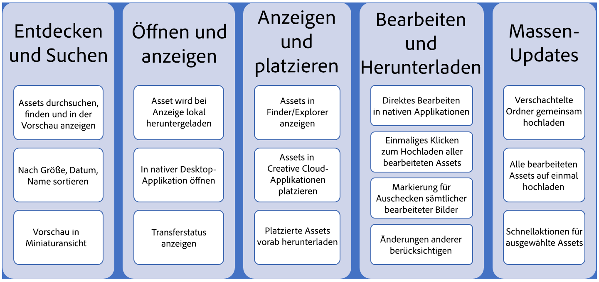

# Übersicht über AEM Desktop-Apps {#overview-v2}

Adobe bietet vernetzte Arbeitsabläufe in allen Lösungen, um eine Produktivität auf nächster Ebene für Ihre Anwender und Kreativprofis zu ermöglichen. Die Adobe Experience Manager-Desktop-App verbindet Repositorys und Desktop-Anwendungen, einschließlich Adobe und Drittanbieter, um einen schnelleren Zugriff auf Ressourcen und optimierte Arbeitsabläufe zu ermöglichen. Durch diese Zeitersparnis und geringeren Aufwand wird die Effizienz von Benutzern verbessert, die mit Adobe Experience Manager-Assets in ihren Desktop-Workflows arbeiten.

Mithilfe der App können die Assets in AEM Assets auf Ihrem lokalen Desktop leicht zugänglich gemacht und in allen Desktop-Anwendungen verwendet werden. Sie können die Assets in Desktop-Anwendungen Ihrer Wahl öffnen und bearbeiten. Die lokalen Änderungen werden in AEM als neue Version des Assets nur dann verfügbar gemacht, wenn Sie die Änderungen hochladen. Dies ermöglicht die effiziente Bearbeitung von Assets auf dem Desktop. Die App unterstützt das Hochladen von Assets und verschachtelten Ordnern zu AEM, wodurch neue Inhalte zum Repository hinzugefügt werden können.

Eine solche Integration ermöglicht es verschiedenen Rollen in der Organisation, die Assets zentral in AEM Assets zu verwalten. Marketingexperten und Geschäftsbenutzer können die Einhaltung der verschiedenen Standards sicherstellen, einschließlich Branding und Lizenzierung. Creative-Benutzer, die auch über ein dediziertes [Adobe Asset Link](https://www.adobe.com/marketing/experience-manager-assets/adobe-asset-link.html) -Tool für die Arbeit mit Assets in Adobe Fotoshop, Illustrator und InDesign verfügen, können auch auf Assets auf dem Desktop in der Creative Cloud und anderen nativen Anwendungen zugreifen.

>[!NOTE]
>
>Die Adobe Experience Manager-Desktop-App wurde in der Version AEM 6.1 eingeführt und früher als AEM Assets Companion App bezeichnet. Hilfe zu App-Version 1.x finden Sie im Inhaltsverzeichnis in der linken Seitenleiste. Adobe empfiehlt ein Upgrade auf die neueste Version 2.

Die Dokumentation zur Desktop-App enthält Informationen zu den folgenden Rollen und Anwendungsfällen.

| Erforderliche Informationen | Hilfeinhalt |
|-------------------------------------------------------------------------------------------------------|------------------------------------------------------------|
| Möchten Sie einen schnellen Überblick über neue Funktionen und Verbesserungen in der neuesten Version erhalten? | [Neue Funktionen in der App](#whats-new-v2) |
| Möchten Sie die Voraussetzungen und technischen Spezifikationen kennen? Möchten Sie Links zum Herunterladen? | [Versionshinweise](release-notes.md) |
| Nicht neu bei der Desktop-App? Aktualisieren und reibungsloser Übergang wünschen? | [Upgrade von früherer Version](install-upgrade.md#upgrade-from-previous-version) |
| Stehen Sie auf und laufen Sie! Möchten Sie die Standardeinstellungen anpassen? | [Installieren und Konfigurieren der App](install-upgrade.md) |
| Erfahren Sie, wie Sie zum Durchsuchen, Erkennen, Bearbeiten, Hochladen, Auflösen von Konflikten, Durchführen von Massenvorgängen usw. verwenden können. | [Verwenden der AEM-Desktop-App](using.md) |
| Ist ein Problem aufgetreten? Benötigen Sie Hilfe bei der Fehlerbehebung? | [Fehlerbehebung bei der AEM-Desktop-App](troubleshoot.md) |

## Neue Funktionen in der App {#whats-new-v2}

Version 2.0 der App wurde aus Gründen erstellt, um im Vergleich zu früheren Versionen viele Verbesserungen zu bieten. Die neue App ist benutzerfreundlicher und bietet eine dedizierte Desktop-Benutzeroberfläche mit einer neuen Anwendung. Benutzer können Assets durch Suchen oder Durchsuchen ermitteln, Änderungen öffnen, bearbeiten und hochladen sowie neue Assets hochladen, ohne dass der Benutzer die AEM-Oberfläche verwenden muss. Diese Version unterstützt auch das Öffnen von Dateien über die AEM-Oberfläche.

Die neue App verbessert die Benutzerfreundlichkeit erheblich und bietet gleichzeitig dieselben Anwendungsfälle wie bisher. Im Folgenden werden die Verbesserungen auf der obersten Ebene beschrieben.

* Die Benutzer können Assets durch Durchsuchen und Suchen in der App in einem integrierten Browser entdecken, anstatt eine virtuelle Netzwerkfreigabe auf Mac Finder oder Windows Explorer anzuzeigen.
* Klare Hinweise zu den Aktionen, die Benutzern zur Verfügung stehen.
* Die Leistung wird durch die Reduzierung der Bandbreitennutzung verbessert. Die ursprünglichen Binärdateien werden nur bei Bedarf heruntergeladen. Beim Durchsuchen und Suchen von Assets werden nur kleine Miniaturansichten übertragen.
* Optimiert für Massenvorgänge, z. B. Massen-Upload.

Die wichtigsten Anwendungsfälle und Verbesserungen der neuen App werden der Customer Journey in der folgenden Abbildung zugeordnet.

Die Desktop-App ermöglicht es den Benutzern, alle oben genannten Anwendungsfälle direkt in der App auszuführen. Bei Bedarf können Sie auch die Asset-Suche in der Weboberfläche durchführen und dann die Steuerung an die App übergeben, um die Assets zu öffnen und zu bearbeiten.
