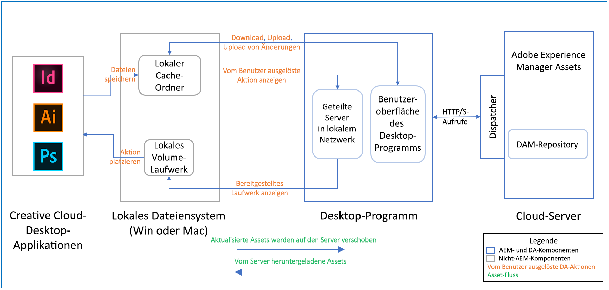

# AEM desktop app release notes {#release-notes-v2}

| Produkte | Adobe Experience Manager (AEM)-Desktop-Programm |
|---------------|--------------------------------------------------------------------|
| Programm-Version (Revision) | 2.0 (2.0.1.1) |
| Unterstützte AEM-Versionen | AEM 6.5, AEM 6.4, AEM 6.3 (mit Kompatibilitätspaket) |
| Typ | Nebenversion |
| Veröffentlichungsdatum | 12. Dezember 2019 (Mac und Win) |
| Download-URLs | [MacOS (64-Bit)](https://download.macromedia.com/aem-assets-companion-app/aem-desktop-osx-2.0.1.1.dmg); [Windows (64-Bit)](https://download.macromedia.com/aem-assets-companion-app/aem-desktop-win64-2.0.1.1.exe); [Windows (32-Bit)](https://download.macromedia.com/aem-assets-companion-app/aem-desktop-win32-2.0.1.1.exe) |

## Systemanforderungen und Voraussetzungen {#system-requirements-and-prerequisites-v2}

Das AEM-Desktop-Programm ist mit den folgenden Betriebssystemen kompatibel:

* Mac OS X 10.10 oder höher mit aktuellen Fehlerbehebungen.
* Windows 7 und Windows 10 mit den neuesten Service Packs und Fehlerbehebungen.

Das Programm kann mit den folgenden AEM-Versionen verwendet werden, unabhängig davon, ob sie lokal oder auf Adobe Managed Services (AMS) bereitgestellt werden:

* [AEM 6.5.0 ](https://helpx.adobe.com/experience-manager/6-5/release-notes.html) oder höher
* [AEM 6.4.4 ](https://helpx.adobe.com/experience-manager/6-4/release-notes/sp-release-notes.html) oder höher
* AEM 6.4.0–6.4.3 mit [Kompatibilitätspaket](https://www.adobeaemcloud.com/content/marketplace/marketplaceProxy.html?packagePath=/content/companies/public/adobe/packages/cq640/featurepack/adobe-asset-link-support)

>[!NOTE]
>
>Die Unterstützung von Desktop-Apps für AEM 6.3 ist veraltet. Adobe empfiehlt ein Upgrade auf eine neuere und unterstützte AEM-Version.
>AEM 6.3.3.1 oder höher funktioniert mit der Desktop-App, nachdem das [Kompatibilitätspaket installiert wurde](https://www.adobeaemcloud.com/content/marketplace/marketplaceProxy.html?packagePath=/content/companies/public/adobe/packages/cq640/featurepack/adobe-asset-link-support). Für AEM 6.3 ist kein solches Paket verfügbar, da keine [Service Packs geplant](https://helpx.adobe.com/experience-manager/maintenance-releases-roadmap.html)sind.

Für die Version des AEM-Desktop-Programms, die Sie auf Ihrem lokalen Computer installieren möchten, sind eine bestimmte Server-Version von Adobe Experience Manager oder zusätzliche Server-seitige Komponenten (Service Packs, Hotfixes oder Feature Packs) erforderlich. Wenden Sie sich zwecks Hilfe an Ihren AEM-Administrator.

### Support for different assets and file types {#support-for-file-types}

Das Programm unterstützt in AEM gespeicherte Assets, die binäre Dateien für die grundlegenden Vorgänge darstellen. Das Öffnen von Dateien in der nativen Desktop-Applikation hängt von der Betriebssystemverknüpfung bestimmter Dateitypen wie PNG oder JPG mit bestimmten Applikationen wie Mac Preview oder Adobe Photoshop ab.

Einige Dateitypen unterstützen das Platzieren von verknüpften Assets in der Binärdatei. Das Programm lädt die verknüpften Assets vorab herunter, wenn das Asset im AEM-Repository vorhanden ist, wenn diese Binärdateien mit dem Desktop-Programm geöffnet werden. Derzeit werden folgende Dateitypen unterstützt:

* Adobe InDesign-Dateien (INDD-Format)
* Adobe Illustrator-Dateien (AI-Format)
* Adobe Photoshop-Dateien (PS-Format)

Die Funktion wird von Adobe Creative Cloud 2018 und Adobe Creative Cloud 2019-Versionen der oben genannten Anwendung unterstützt. Das Programm verwendet einen heuristischen, Best-Match-Ansatz, um die lokalen Desktop-Pfade verknüpfter Assets URLs auf dem AEM-Server zuzuordnen. Er beruht auf einigen Annahmen:

* Paths to placed files in the native application use a global desktop path (placed from the local network share shown with [!UICONTROL Reveal] option).
* Pfade werden von der nativen Applikation im XMP-Datensatz der Datei gespeichert.
* AEM hat den XMP-Datensatz mit den Pfaden zum Metadatensatz des Assets extrahiert.
* Die Pfade können mit Assets in AEM übereinstimmen, d. h. die platzierten Dateien befinden sich auch in AEM unter einem übereinstimmenden Pfad).

## Neue Funktionen und Erweiterungen {#whats-new-added}

To know the details, see [What's new in v2.0](introduction.md#whats-new-v2).

Fehlerbehebungen und Aktualisierungen in Version 2.0.1 sind:

* Option zum Konfigurieren des `%Temp%` Ordners mit dem `%APPDATA%` Pfad zulassen. <!-- CQ-4282665 -->
* Erlauben Sie Benutzern, sich über die Okta SAML-Authentifizierung bei AEM Author anzumelden. <!-- CQ-4278134 -->

## Installationsanweisungen {#installation-instructions-v2}

Informationen zum Installieren und Konfigurieren des Programms finden Sie unter [Installieren des AEM-Desktop-Programms](install-upgrade.md).

Wenn Sie von einer vorherigen Version des AEM-Desktop-Programms aktualisieren, müssen Sie die folgenden Best Practices für die Umstellung befolgen, die unter [Upgrade von früherer Version](install-upgrade.md#upgrade-from-previous-version) aufgeführt werden.

## Wichtige Hinweise zur Funktionsweise des Programms{#how-app-works}

Es ist wichtig, die folgenden Informationen zum Programm und dessen Funktionsweise zu verstehen.

* Das Programm bietet vollständige Kontrolle über Vorgänge, bei denen Asset-Binärdateien vollständig von und nach AEM übertragen werden müssen (Öffnen, Bearbeiten, Hochladen von Assets und Hochladen von Änderungen).
   * Wenn Sie mit dem Asset auf dem Desktop arbeiten möchten, müssen Sie es explizit auf Ihrem Desktop öffnen, bearbeiten oder herunterladen, entweder einzeln, in einem Ordner oder über eine Mehrfachauswahl.
   * Wenn Sie möchten, dass lokale Änderungen an in AEM hochgeladen werden, müssen Sie [!UICONTROL Upload Changes] entweder einzeln oder über eine Mehrfachauswahl auswählen.
   * Das Programm ist kein „Synchronisierungs-Client“, der Assets auf dem Desktop und in AEM synchron hält.
   * Das Programm stellt keine Netzwerkfreigabe bereit, die das AEM-Repository als eine virtuelle Ordnerstruktur zuordnet.
* Die Liste der vom Programm angezeigten Assets basiert auf dem Status des AEM Assets-Repositorys. Dateien, die lokal heruntergeladen und dann in den lokalen Dateien oder im Cache-Ordner umbenannt wurden, werden vom Programm nicht angezeigt oder verwaltet.
* Wenn das Programm nicht die erwarteten Ergebnisse anzeigt, klicken Sie in der oberen Leiste auf das Aktualisierungssymbol.
* Die lokale Netzwerkfreigabe, bei Verwendung der Aktion [!UICONTROL Reveal File]. Sie zeigt nur Dateien (und Ordner) an, die lokal verfügbar sind. [!UICONTROL Reveal File] und [!UICONTROL Reveal Folder] lädt Assets vorab herunter, damit die richtigen Assets in der lokalen Netzwerkfreigabe angezeigt werden.
* Die lokale Netzwerkfreigabe SMB (Mac)/WebDAV (Win) wird verwendet, wenn eine Adobe Creative Cloud-Applikation die Asset-Dateien liest, die verknüpft sind/in einer nativen Datei der Creative Cloud-Applikation platziert wurden.

Das folgende Diagramm zeigt den Fluss von Assets und Dateien von der Cloud zum lokalen Dateisystem und umgekehrt, der durch Benutzeraktionen initiiert wird.

## Bekannte Probleme {#known-issues-v2}

**Probleme mit der Benutzeroberfläche:**

* Manchmal kann die Oberfläche der Desktop-App leer sein. Right-click and click [!UICONTROL Refresh] to re-load the application. Nach einer solchen Aktualisierung beginnen Sie am Stammordner des DAM-Repositorys. Aktualisierungen oder Status Ihrer Assets werden beibehalten. <!-- CQ-4270267 -->
* Die Navigation in Ordnern/Suchergebnissen ohne Trackpad oder Mauszeiger ist schwierig. The scroll-bar might not appear with mouse devices without mouse wheel. <!-- CQ-4269947 -->
* In seltenen Fällen wird die Fortschrittsleiste nicht korrekt angezeigt, wenn sich das hochgeladene Asset ändert.
* Nach dem Anwenden und Entfernen des Filters, um alle lokal bearbeiteten Assets zu finden, wechselt das Programm nicht zu den Suchergebnissen oder der Ordneransicht, mit denen die Benutzer begonnen haben. Das Programm zeigt den Stammordner des DAM-Repositorys an.
* Wenn Sie eine Verbindung zu einer URL herstellen, bei der kein AEM-Server ausgeführt wird, reagiert der Bildschirm „Verbindung“ manchmal nicht mehr. Beenden Sie das Programm und starten Sie es erneut.

**CRUD-Probleme (Erstellen, Lesen, Aktualisieren und Löschen):**

* Das Programm versucht, Dateien auch mit ungültigen Zeichen hochzuladen, was möglicherweise zu einem Server-seitigen Upload-Fehler führt. <!-- CQ-4273652 -->
* Beim Hochladen von Änderungen zu einem Asset mit Kommentaren werden die Kommentare zusammen mit dem Asset in AEM gespeichert, jedoch nicht als Versionskommentare sichtbar. Dieses Problem wurde in AEM 6.4.5 und AEM 6.5.1 behoben. Adobe empfiehlt dringend, die neuesten Service Packs zu installieren. <!-- CQ-4268990 -->
* Asset-Übertragungen können vom Benutzer nicht abgebrochen werden. Wenn Sie eine unbeabsichtigte große Übertragung ausgelöst haben, beenden Sie das Programm und starten Sie es erneut. <!-- CQ-4278940 -->

**Plattformfragen:**

* Unter Windows ändert sich der Status eines Assets unter Umständen sofort nach dem Öffnen in [!UICONTROL Edited Locally], auch wenn Sie es möglicherweise nicht bearbeitet haben. Klicken Sie zur Aktualisierung auf [!UICONTROL Refresh].

>[!MORELIKETHIS]
>
>* [Dokumentation zu AEM 6.5](https://helpx.adobe.com/support/experience-manager/6-5.html)
>* [Dokumentation zu AEM Assets 6.5](https://docs.adobe.com/content/help/en/experience-manager-65/assets/home.html)
>* [Verwenden der AEM-Desktop-App](using.md)
>* [Installieren und Aktualisieren des Desktop-Programms](install-upgrade.md)
>* [Best Practices und Fehlerbehebung](troubleshoot.md)

