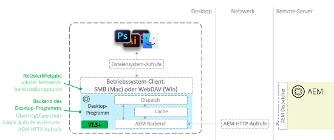

# Fehlerbehebung für die AEM-Desktop-App, v1.x {#troubleshoot-aem-desktop-app}

Führen Sie eine Fehlerbehebung für die AEM-Desktop-App durch, um die vereinzelten Probleme zu lösen, die bei der Installation, bei Upgrades, bei der Konfiguration usw. auftreten können.

Die Adobe Experience Manager (AEM)-Desktop-App beinhaltet Dienstprogramme, die Sie beim Zuordnen des AEM Assets-Repositorys als Netzwerkfreigabe auf dem Desktop unterstützen (SMB-Freigabe unter macOS). Bei der Netzwerkfreigabe handelt es sich um eine Betriebssystemtechnologie, mit deren Hilfe Remote-Quellen so behandelt werden können, als würden sie zum lokalen Dateisystem eines Computers gehören. Im Falle der Desktop-App ist die Digital-Asset-Management-Repository-Struktur einer AEM-Remote-Instanz die als Ziel gewählte Remote-Dateiquelle. In der folgenden Abbildung wird die Topologie der Desktop-App beschrieben:



Mit dieser Architektur fängt die Desktop-App Dateisystemaufrufe (Öffnen, Schließen, Lesen, Schreiben usw.) an die bereitgestellte Netzwerkfreigabe ab und übersetzt sie in systemeigene AEM-HTTP-Aufrufe an den AEM-Server. Dateien werden lokal zwischengespeichert. Weitere Informationen finden Sie unter [Verwenden der AEM Desktop-App, Version 1.x](use-app-v1.md).

## AEM desktop app component overview {#desktop-app-component-overview}

Die Desktop-App beinhaltet die folgenden Komponenten:

* **Die Desktopanwendung**: Die Anwendung führt DAM als Remote-Dateisystem ein oder aus und übersetzt Dateisystemaufrufe zwischen der lokal bereitgestellten Netzwerkfreigabe und der Remote-AEM-Instanz, mit der die Verbindung hergestellt wird.
* **WebDAV/SMB-Client des Betriebssystems**: Verarbeitet die Kommunikation zwischen Windows Explorer/Finder und der Desktop-App. Beim Abrufen, Erstellen, Ändern, Löschen, Verschieben oder Kopieren einer Datei kommuniziert der WebDAV/SMB-Client des Betriebssystems diesen Vorgang an die Desktop-App. Sobald die Kommunikation eingegangen ist, wird sie von der Desktop-App in systemeigene AEM-Remote-API-Aufrufe übersetzt. Wenn ein Benutzer beispielsweise in dem bereitgestellten Verzeichnis eine Datei erstellt, initiiert der WebDAV/SMB-Client eine Anfrage. Diese Anfrage wird von der Desktop-App in eine HTTP-Anfrage zur Erstellung der Datei in DAM übersetzt. Beim WebDAV/SMB-Client handelt es sich um eine integrierte Komponente des Betriebssystems. Er steht in keiner Weise mit der Desktop-App, mit AEM oder Adobe in Verbindung.
* **Adobe Experience Manager-Instanz**: Bietet Zugriff auf die Assets, die im DAM-Repository von AEM Assets gespeichert sind. Darüber hinaus führt sie von der Desktop-App angeforderte Aktionen im Namen der lokalen Desktop-Applikationen aus, indem sie mit der bereitgestellten Netzwerkfreigabe interagiert. Auf der AEM-Zielinstanz sollte AEM-Version 6.1 oder höher ausgeführt werden. Für AEM-Instanzen mit vorherigen AEM-Versionen müssen möglicherweise zusätzliche Feature Packs und Hotfixes installiert werden, um die vollständige Funktionalität zu erreichen.

## Vorgesehene Verwendungsfälle der AEM-Desktop-App {#intended-use-cases-for-aem-desktop-app}

Die AEM-Desktop-App greift auf die Netzwerkfreigabetechnologie zurück, um ein AEM-Remote-Repository einem lokalen Desktop zuzuordnen. Sie ist jedoch nicht als Ersatz für eine Netzwerkfreigabe mit Assets vorgesehen, bei der die Benutzer direkt auf ihrem lokalen Desktop Digital-Asset-Management-Vorgänge ausführen. Dazu zählen das Verschieben oder Kopieren mehrerer Dateien oder das Ziehen umfangreicher Ordnerstrukturen zu der AEM Assets-Netzwerkfreigabe direkt im Finder/Explorer.

Die AEM-Desktop-App bietet eine praktische Methode zum Zugreifen auf (Öffnen) und Bearbeiten (Speichern) von DAM-Assets zwischen der Touch-optimierten Benutzeroberfläche von AEM Assets und dem lokalen Desktop. Sie verknüpft Assets auf dem AEM Assets-Server mit Ihren Desktop-basierten Workflows.

Der folgende Beispielanwendungsfall veranschaulicht, wie AEM Desktop verwendet werden sollte:

* Ein Benutzer meldet sich bei AEM an und verwendet die Web-Benutzeroberfläche, um ein Asset zu suchen.
* Er nutzt bei Bedarf die Funktionen für Desktop-Aktionen der AEM-Web-Benutzeroberfläche zum Öffnen, Anzeigen oder Bearbeiten des Assets auf dem Desktop.
* AEM Desktop öffnet das Asset im Standard-Editor für den Dateityp des Assets.
* Der Benutzer nimmt die gewünschten Änderungen am Asset vor.
* Nachdem eine Datei geändert wurde, kann der Benutzer den Synchronisierungsstatus der Datei im Statusfenster für die Hintergrundsynchronisierung von AEM Desktop anzeigen.
* Mithilfe des Kontextmenüs von AEM Desktop checkt der Benutzer das Asset ein/aus oder gibt es an die DAM-Benutzeroberfläche zurück.
* Nach Abschluss der Änderungen an der Datei kehrt der Benutzer zur AEM-Web-Benutzeroberfläche zurück.

Dies ist nicht der einzige Anwendungsfall. Er veranschaulicht jedoch die bequeme Methode zum lokalen Zugreifen auf/Bearbeiten von Assets über AEM Desktop. Sie sollten die DAM-Web-Benutzeroberfläche so oft wie möglich verwenden, da sie ein besseres Erlebnis bietet. Sie ermöglicht Adobe mehr Flexibilität beim Erfüllen der Kundenanforderungen.

## Beschränkungen {#limitations}

Die WebDAV/SMB1-Netzwerkfreigabe bietet den Komfort, in einem Explorer/Finder-Fenster mit Dateien arbeiten zu können. Explorer/Finder und AEM kommunizieren jedoch über eine Netzwerkverbindung, die gewissen Einschränkungen unterliegt. Die zum Kopieren einer 1 GB großen Datei in das bereitgestellte WebDAV/SMB-Verzeichnis benötigte Zeit ist beispielsweise identisch mit dem Zeitaufwand zum Hochladen einer 1 GB großen Datei auf eine Website mit einem Webbrowser. Tatsächlich kann im ersten Fall mehr Zeit nötig sein. Ursache dafür sind die Ineffizienzen des WebDAV/SMB-Protokolls und der WebDAV/SMB-Clients des Betriebssystems (insbesondere Mac OS X).

Die mit einem bereitgestellten Verzeichnis ausführbaren Aufgaben sind beschränkt. Generell kann sich das Arbeiten mit großen Dateien schwierig gestalten, insbesondere bei schlechten Netzwerkverbindungen oder Netzwerkverbindungen mit hoher Latenz/geringer Bandbreite und insbesondere beim Bearbeiten großer Dateien.

Adobe empfiehlt, einige Anwendungsfälle zu testen, bevor Sie einem Kunden bestätigen, dass bestimmte Dateitypen über das bereitgestellte Verzeichnis effizient bearbeitet werden können.

Die AEM-Desktop-App ist für intensive Manipulationen des Dateisystems nicht geeignet. Dazu zählen unter anderem die folgenden Vorgänge:

* Verschieben oder Kopieren von Dateien und Verzeichnissen
* Hinzufügen vieler Assets zu AEM
* Suchen nach und Öffnen von Dateien über das Dateisystem, außer Durchsuchen von Ordnern
* Komprimieren oder Dekomprimieren von Dateiarchiven

Aufgrund der Beschränkungen des Betriebssystems gilt für Windows eine Dateigrößenbeschränkung von 4.294.967.295 Byte (ca. 4,29 GB). Der Grund dafür ist eine Registrierungseinstellung, die definiert, wie groß eine Datei auf einer Netzwerkfreigabe sein darf. Der Wert der Registrierungseinstellung ist ein DWORD-Ausdruck mit einer maximalen Größe, die der referenzierten Zahl entspricht.

## Caching und Kommunikation mit AEM {#caching-and-communication-with-aem}

Die AEM-Desktop-App bietet interne Caching-Funktionen und Funktionen zum Upload im Hintergrund, um das Endbenutzererlebnis zu verbessern. Wenn Sie eine große Datei speichern, wird sie zuerst lokal gespeichert, sodass Sie Ihre Arbeit fortsetzen können. Nach einer gewissen Zeit (momentan 30 Sekunden) wird die Datei dann im Hintergrund an den AEM-Server gesendet.

Im Gegensatz zu Creative Cloud Desktop oder anderen Dateisynchronisierungslösungen wie Microsoft One Drive handelt es sich bei der AEM-Desktop-App nicht um einen vollständigen Desktop-Synchronisierungs-Client. Der Grund dafür liegt darin, dass sie Zugriff auf das gesamte AEM Assets-Repository bietet, das für eine vollständige Synchronisierung extrem umfangreich sein kann (mehrere hunderte Gigabyte oder Terabyte).

Das Caching bietet die Möglichkeit, den Mehraufwand bezüglich des Netzwerks/Speichers auf eine Teilmenge von Assets zu beschränken, die für den Benutzer relevant sind.

So erfolgt das Caching in der AEM-Desktop-App:

* Beim Öffnen eines Ordners in Finder und Anzeigen einer Miniaturansicht/Vorschau von Dateien oder beim Öffnen einer Datei in einer Applikation speichert die Desktop-App die Datei binär.
* Beim Speichern von Dateien per Finder oder mit anderen Desktop-Applikationen wird die Datei zunächst lokal gespeichert (zwischengespeichert) und das Betriebssystem wird benachrichtigt. Anschließend wird die Datei im Hintergrund in die Warteschlange zum Hochladen auf den Server verschoben und schließlich über das Netzwerk hochgeladen. Im Falle eines Netzwerkfehlers versucht die Desktop-App erneut, die gesamte Datei hochzuladen. Dieser Versuch erfolgt maximal dreimal. Wenn der Upload nach drei Wiederholungen fehlschlägt, wird die Datei als in Konflikt stehende Datei markiert und der Status wird im Fenster mit dem Upload-Status der Warteschlange im Hintergrund angezeigt. Die Desktop-App unternimmt keinen weiteren Versuch, die Datei zu aktualisieren. Der Benutzer sollte die Datei aktualisieren und nach dem Wiederherstellen der Verbindung erneut hochladen.

Es wird nicht jeder Vorgang lokal zwischengespeichert. Folgendes wird sofort ohne lokales Caching an den AEM-Server gesendet:

* Jegliche Vorgänge für Ordner, z. B. Erstellen, Löschen usw.
* Mithilfe der in Version 1.4 eingeführten Funktion „Folder Upload“ (Ordner hochladen) wird eine lokale Ordnerhierarchie ohne lokales Caching der Dateien hochgeladen.

## Individuelle Vorgänge  {#individual-operations}

When troubleshooting sub-optimized performance for individual users, first review [Limitations](https://helpx.adobe.com/experience-manager/desktop-app/troubleshooting-desktop-app.html#limitations). Die folgenden Abschnitte umfassen Vorschläge zur Verbesserung der Performance für einzelne Benutzer.

## Bandbreitenempfehlungen  {#bandwidth-recommendations}

Die für einen einzelnen Benutzer verfügbare Bandbreite spielt eine entscheidende Rolle bei der Performance des WebDAV/SMB-Clients.

Adobe empfiehlt für einzelne Benutzer eine Upload-Geschwindigkeit von ca. 10 MBit/s. Bei drahtlosen Verbindungen wird die Bandbreite oftmals zwischen mehreren Benutzern aufgeteilt. Wenn mehrere Benutzer gleichzeitig Aufgaben durchführen, die Netzwerkbandbreite verbrauchen, kann sich die Performance weiter verschlechtern. Verwenden Sie eine kabelgebundene Verbindung, um derartige Probleme zu vermeiden.

## Windows-spezifische Konfigurationen  {#windows-specific-configurations}

Wenn Sie AEM unter Windows ausführen, können Sie Windows so konfigurieren, dass die Performance des WebDAV-Clients verbessert wird. Weitere Informationen dazu finden Sie unter [https://support.microsoft.com/en-us/kb/2445570](https://support.microsoft.com/en-us/kb/2445570).

Unter Windows 7 kann die Leistung von WebDAV durch eine Änderung der IE-Einstellungen verbessert werden. Einzelheiten dazu finden Sie unter [http://oddballupdate.com/2009/12/fix-slow-webdav-performance-in-windows-7/](http://oddballupdate.com/2009/12/fix-slow-webdav-performance-in-windows-7/).

## Gleichzeitig ausgeführte Vorgänge  {#concurrent-operations}

Wenn Sie lokal mit einer Datei interagieren, überprüft AEM Desktop, ob in AEM eine neuere Version der Datei verfügbar ist. Wenn eine neue Version verfügbar ist, lädt die Applikation eine neue Kopie der Datei in den lokalen Cache herunter. AEM Desktop überschreibt jedoch eine lokal zwischengespeicherte Datei nicht, wenn sie geändert wurde. Diese Funktion verhindert, dass Ihre Arbeit unbeabsichtigt überschrieben wird.

Wenn dieselbe Datei sowohl lokal als auch in AEM geändert wird, überschreibt die lokal geänderte Version die Version in AEM. In diesem Fall ist die vorherige Version in der Zeitleiste des Assets verfügbar. Sie können beide Versionen überprüfen und Konflikte lösen.

Wenn eine lokale Datei mit der auf dem Server verfügbaren Version inkompatibel ist, werden Sie über das Dialogfeld mit dem Status für den Upload im Hintergrund über den Konflikt benachrichtigt. Öffnen Sie zum Beheben des Problems die in Konflikt stehende Datei und speichern Sie sie. Das Speichern der Datei zwingt AEM Desktop zur Synchronisierung Ihrer letzten Änderungen in AEM. Sie können die vorherigen Versionen des Assets in der Zeitachse anzeigen und jegliche Konflikte auflösen.

Sie sollten zusätzliche Faktoren berücksichtigen, wenn mehrere Benutzer versuchen, in separat bereitgestellten Verzeichnissen zu arbeiten, die auf dieselbe AEM-Instanz ausgerichtet sind. Insbesondere sind die folgenden Faktoren wichtig:

* Die verfügbare Bandbreite im ursprünglichen Netzwerk des Benutzers
* Netzwerkkonfiguration wie Firewalls oder Proxys des ursprünglichen Netzwerks
* Verfügbare Bandbreite im Netzwerk der AEM-Zielinstanz
* Ob vor der AEM-Zielinstanz ein Dispatcher vorhanden ist
* Aktuelle Auslastung der AEM-Zielinstanz

## Zusätzliche AEM-Konfigurationen  {#additional-aem-configurations}

Wenn sich die WebDAV/SMB-Leistung drastisch vermindert, wenn mehrere Benutzer gleichzeitig arbeiten, können Sie in AEM einige Einstellungen konfigurieren, um die Leistung zu verbessern.

## Aktualisieren des Übergangs-Workflows für Assets  {#update-asset-transient-workflows}

Sie können die Leistung auf AEM-Seite verbessern, indem Sie für den Workflow „DAM-Update-Asset“ Übergangs-Workflows aktivieren. Durch die Aktivierung von Übergangs-Workflows wird die zum Aktualisieren von Assets erforderliche Leistung reduziert, wenn sie in AEM erstellt oder aktualisiert werden.

1. Navigieren Sie in der zu konfigurierenden AEM-Instanz zu `/miscadmin` (z. B. `http://[Server]:[Port]/miscadmin`).
1. Erweitern Sie im Navigationsbaum **Tools** &gt; **Workflow** &gt; **Modelle** &gt; **dam**.
1. Doppelklicken Sie auf **DAM-Update-Asset**.
1. Wechseln Sie im unverankerten Tool-Fenster auf die Registerkarte **Seite** und klicken Sie dann auf **Seiteneigenschaften**.
1. Aktivieren Sie das Kontrollkästchen **Verlaufs-Workflow** und klicken Sie auf **OK**.

### Anpassen der Warteschlange für die Granite-Übergangs-Workflows {#adjust-granite-transient-workflow-queue}

Eine weitere Methode zum Verbessern der AEM-Leistung besteht darin, den Wert der maximal zulässigen parallelen Aufträge für die Warteschlange für Granite-Übergangs-Workflows zu konfigurieren. Der empfohlene Wert ist etwa die Hälfte der CPU, die mit dem Server verfügbar ist. Führen Sie die folgenden Schritte aus, um den Wert anzupassen:

1. Navigieren Sie in der zu konfigurierenden AEM-Instanz zu */system/console/configMgr* (z. B. <http://&lt;Server&gt;:&lt;Port&gt;/system/console/configMgr>).
1. Suchen Sie nach **QueueConfiguration** und klicken Sie, um die einzelnen Aufträge zu öffnen, bis Sie den Auftrag **Warteschlange für Granite-Übergangs-Workflow** gefunden haben. Klicken Sie daneben auf das Symbol „Bearbeiten“.
1. Ändern Sie den Wert **Maximale Anzahl an parallelen Aufträgen** und klicken Sie auf **Speichern**.

## AWS-Konfiguration  {#aws-configuration}

Aufgrund der Netzwerk-Bandbreitenbeschränkungen kann sich die Leistung von WebDAV/SMB verschlechtern, wenn mehrere Benutzer gleichzeitig arbeiten. Adobe empfiehlt, die Größe der AWS-Instanz für eine AEM-Zielinstanz zu erhöhen, die in AWS ausgeführt wird, um die WebDAV/SMB-Leistung zu verbessern.

Durch diese Maßnahme wird insbesondere die für den Server verfügbare Netzwerkbandbreite erhöht. Im Folgenden finden Sie einige Details dazu:

* Die für eine AWS-Instanz dedizierte Netzwerkbandbreite nimmt mit steigender Größe der Instanz zu. Informationen zu der für die einzelnen Instanzgrößen verfügbaren Bandbreite finden Sie in der [AWS-Dokumentation](https://aws.amazon.com/ec2/instance-types/).
* Im Rahmen der Fehlerbehebung für einen großen Kunden hat Adobe die Größe seiner AEM-Instanz auf c4.8xlarge konfiguriert, hauptsächlich für die dedizierte Bandbreite von 4000 MBit/s, die bereitgestellt wird.
* Wenn sich vor der AEM-Instanz ein Dispatcher befindet, stellen Sie sicher, dass er eine geeignete Größe hat. Wenn die AEM-Instanz 4000 MBit/s, der Dispatcher jedoch nur 500 MBit/s bereitstellt, beträgt die effektive Bandbreite lediglich 500 MBit/s. Die Ursache dafür ist der Engpass, der sich durch den Dispatcher ergibt.

## Beschränkungen für ausgecheckte Dateien  {#checked-out-file-limitations}

Es existieren einige bekannte Beschränkungen hinsichtlich der Art und Weise, wie Sie im Explorer/Finder mit ausgecheckten Dateien interagieren können. Wenn eine Datei ausgecheckt ist, sollte sie mit Ausnahme des Benutzers, der sie auscheckt, für alle Personen schreibgeschützt sein. Diese Regel wird durch die Implementierung des WebDAV/SMB1-Protokolls in AEM erzwungen. Die WebDAV/SMB-Clients des Betriebssystems interagieren jedoch häufig nicht perfekt mit ausgecheckten Dateien. Einige Eigenheiten werden im Folgenden beschrieben.

### Allgemein {#general}

Beim Schreiben in eine ausgecheckte Datei wird die Sperre nur in der AEM WebDAV-Implementierung erzwungen. Infolgedessen wird die Sperre nur von Clients erzwungen, die WebDAV verwenden (z. B. Desktop-App). Die Sperre wird nicht über die AEM-Weboberfläche erzwungen. In der AEM-Oberfläche wird lediglich für ausgecheckte Assets ein Schloss-Symbol in der Kartenansicht angezeigt. Das Symbol hat nur kosmetischen Charakter und keine Auswirkung auf das AEM-Verhalten.

Die WebDAV-Clients verhalten sich nicht immer erwartungsgemäß. Es können weitere Probleme auftreten. Eine Aktualisierung oder Überprüfung des Assets in AEM ist jedoch eine geeignete Methode, um sicherzustellen, dass ein Asset nicht im Moment bearbeitet wird. Dieses Verhalten ist typisch für WebDAV-Clients des Betriebssystems. Adobe hat keinen Einfluss darauf.

### Windows {#windows}

Das Löschen einer Datei scheint erfolgreich zu sein, da die Datei nicht mehr im Datei-Explorer von Windows angezeigt wird. Beim Aktualisieren des Verzeichnisses und der Überprüfung in AEM Assets wird jedoch deutlich, dass die Datei noch vorhanden ist. Darüber hinaus scheint das Bearbeiten von Dateien erfolgreich zu verlaufen (es werden keine Warnungsdialogfelder oder Fehlermeldungen angezeigt). Beim Erneuten Öffnen der Datei oder der Überprüfung in AEM Assets wird jedoch deutlich, dass die Datei unverändert ist.

#### Mac OS X  {#mac-os-x}

Beim Ersetzen einer Datei wird keine Warnung und kein Fehler angezeigt, aber bei der Überprüfung des Assets in AEM wird deutlich, dass es unverändert ist. Aktualisieren oder überprüfen Sie das Asset in AEM, um sicherzustellen, dass es nicht geändert wird.

## Fehlerbehebung für Probleme mit dem Symbol der Desktop-App (Mac OS X) {#troubleshooting-desktop-app-icon-issues-mac-os-x}

Nach dem Installieren der Desktop-App wird in der Menüleiste das Menüsymbol der Desktop-App angezeigt. Wenn das Symbol nicht angezeigt wird, führen Sie die folgenden Schritte aus, um das Problem zu beheben:

1. Öffnen Sie das Terminalfenster des Betriebssystems.
1. Geben Sie den folgenden Befehl in das Befehlszeilenfenster ein und drücken Sie dann die Eingabetaste:

   ```shell
    cd ../Library/Caches.
   ```

1. Geben Sie den folgenden Befehl ein und drücken Sie die Eingabetaste:

   ```shell
   rm -r com.adobe.aem.assetscompanion 
   ```

1. Geben Sie den folgenden Befehl ein und drücken Sie die Eingabetaste:

   ```shell
   cd ~/Library/Preferences
   ```

1. Geben Sie den folgenden Befehl ein und drücken Sie die Eingabetaste:

   ```shell
   rm com.adobe.aem.assetscompanion.plist
   ```

1. Geben Sie den folgenden Befehl ein und drücken Sie die Eingabetaste:

   ```shell
   rm ~/Library/Group\ Containers/group.com.adobe.aem.desktop/*
   ```

1. Starten Sie das System neu.

AEM-Desktop unternimmt für beliebige Dateien drei Synchronisierungsversuche. Wenn die Synchronisierung der Datei nach dem dritten Mal fehlschlägt, geht die AEM-Desktop-App davon aus, dass für die Datei ein Konflikt vorliegt, und Sie werden über das Statusfenster für den Upload im Hintergrund darüber benachrichtigt. Ein Konfliktzustand gibt an, dass Ihre letzten Änderungen weiterhin lokal verfügbar sind, sie jedoch nicht wieder mit AEM synchronisiert werden. Die AEM-Desktop-App versucht nicht mehr zu synchronisieren.

Die einfachste Methode zum Beheben dieser Situation besteht darin, die in Konflikt stehende Datei zu öffnen und erneut zu speichern. Dadurch wird AEM gezwungen, drei weitere Synchronisierungsversuche zu unternehmen. Wenn das Synchronisieren der Datei weiterhin fehlschlägt, lesen Sie für weitere Hilfe die Abschnitte unten.

## Löschen des AEM-Desktop-Caches {#clearing-aem-desktop-cache}

Beim Löschen des Caches von AEM Desktop handelt es sich um eine vorläufige Aufgabe zur Fehlerbehebung, durch die verschiedene Probleme mit AEM Desktop gelöst werden können.

Sie können den Cache löschen, indem Sie das Cache-Verzeichnis der Applikation unter den folgenden Verzeichnissen löschen: Windows: %LocalAppData%\Adobe\AssetsCompanion\Cache\

Mac: ~/Library/Group/Containers/group.com.adobe.aem.desktop/cache/

Das Verzeichnis kann sich jedoch in Abhängigkeit vom konfigurierten AEM-Endpunkt von AEM Desktop ändern. Der Wert ist eine codierte Version der Ziel-URL. Wenn das Ziel der Applikation beispielsweise `http://localhost:4502` ist, lautet der Verzeichnisname `http%3A%2F%2Flocalhost%3A4502%2F`.

Wenn Sie den Cache löschen möchten, löschen Sie das Verzeichnis &lt;Codierter AEM-Endpunkt&gt;.

>[!NOTE]
>
>Wenn Sie den AEM Desktop-Cache löschen, gehen dabei nicht mit AEM synchronisierte Änderungen lokaler Dateien verloren.

>[!NOTE]
>
>Ab Version 1.5 der AEM-Desktop-App ist in der Desktop-App-Benutzeroberfläche eine Option zum Löschen des Cache verfügbar.

## Ermitteln der AEM-Desktop-Version {#finding-the-aem-desktop-version}

Das Verfahren zum Ermitteln der AEM Desktop-Version ist für Windows und Mac OS identisch.

Klicken Sie auf das AEM Desktop-Symbol und wählen Sie dann **About** (Info) aus. Daraufhin wird die Versionsnummer auf dem Bildschirm angezeigt.

## Durchführen von Upgrades für die AEM-Desktop-App unter macOS {#upgrading-aem-desktop-app-on-macos}

Gelegentlich können bei einem Upgrade der AEM-Desktop-App unter macOS Probleme auftreten. Die Ursache liegt darin, dass der alte Systemordner der AEM-Desktop-App verhindert, dass neue Versionen der AEM-Desktop-App korrekt geladen werden. Zur Behebung dieses Problems können die folgenden Ordner und Dateien manuell entfernt werden.

Bevor Sie die unten aufgeführten Schritte durchführen, ziehen Sie die Applikation „Adobe Experience Manager Desktop“ vom macOS-Applikationsordner in den Papierkorb. Öffnen Sie dann Terminal und führen Sie den folgenden Befehl aus, indem Sie bei Aufforderung Ihr Kennwort eingeben.

```shell
sudo rm -rf ~/Library/Application\ Support/com.adobe.aem.desktop
sudo rm -rf ~/Library/Preferences/com.adobe.aem.desktop.plist
sudo rm -rf ~/Library/Logs/Adobe\ Experience\ Manager\ Desktop

sudo find /var/folders -type d -name "com.adobe.aem.desktop" | xargs rm -rf
sudo find /var/folders -type d -name "com.adobe.aem.desktop.finderintegration-plugin" | xargs rm -rf
```

## Speichern einer von anderen Benutzern ausgecheckten Datei  {#saving-a-file-checked-out-by-others}

Technische Beschränkungen des Betriebssystems verhindern ein konsistentes Benutzererlebnis beim versuchten Überschreiben einer Datei, die von anderen Benutzern ausgecheckt wurde. Das Erlebnis variiert je nach Applikation, die zum Bearbeiten der ausgecheckten Datei verwendet wird. Mitunter zeigt die Applikation eine Fehlermeldung mit dem Hinweis an, dass ein Fehler beim Schreiben auf das Laufwerk aufgetreten ist, oder es wird ein scheinbar nicht relevanter oder allgemeiner Fehler angezeigt. Es kann auch sein, dass gar keine Fehlermeldung angezeigt und der Vorgang scheinbar erfolgreich ausgeführt wird.

In diesem Fall können Sie durch Schließen und erneutes Öffnen der Datei feststellen, dass die Inhalte unverändert sind. Bei einigen Applikationen wird jedoch möglicherweise eine Sicherung der Datei gespeichert, sodass Ihre Änderungen übernommen werden können.

Unabhängig vom Verhalten bleibt die Datei unverändert, wenn Sie sie einchecken. Selbst wenn eine andere Version der Datei angezeigt wird, erfolgt keine Synchronisierung der Änderungen mit AEM.

## Beheben von Problemen beim Verschieben von Dateien  {#troubleshooting-problems-around-moving-files}

Für die Server-API müssen zusätzliche Header und Werte für X-Ziel, X-Tiefe und X-Überschreiben übergeben werden, damit die Verschiebungs- und Kopiervorgänge funktionieren. Standardmäßig werden diese Header vom Dispatcher nicht übergeben, wodurch diese Vorgänge fehlschlagen. Weitere Informationen finden Sie unter [Herstellen einer Verbindung zu AEM hinter einem Dispatcher](install-configure-app-v1.md#connect-to-an-aem-instance-behind-a-dispatcher).

## Beheben von AEM Desktop-Verbindungsproblemen  {#troubleshooting-aem-desktop-connection-issues}

### Problem bei SAML-Umleitung {#saml-redirect-issue}

Die häufigste Ursache für Probleme beim Herstellen einer Verbindung zwischen AEM Desktop und Ihrer SSO-fähigen (SAML) AEM-Instanz ist die Tatsache, dass der SAML-Prozess keine Zurückleitung zum ursprünglich angeforderten Pfad durchführt. Alternativ kann die Verbindung an einen Host umgeleitet werden, der in AEM Desktop nicht konfiguriert ist. Führen Sie die folgenden Schritte durch, um den Anmeldungsprozess zu überprüfen:

1. Öffnen Sie einen Webbrowser.
1. Geben Sie in der Adresszeile die URL `/content/dam.json` an.
1. Ersetzen Sie die URL durch die AEM-Zielinstanz, z. B. `http://localhost:4502/content/dam.json`.
1. Melden Sie sich bei AEM an.
1. Überprüfen Sie nach der Anmeldung die aktuelle Adresse des Browsers in der Adresszeile. Sie sollte mit der ursprünglich von Ihnen eingegeben URL übereinstimmen.
1. Stellen Sie sicher, dass alle Angaben vor `/content/dam.json` mit dem in der AEM-Desktop-App konfigurierten AEM-Zielwert übereinstimmen.

### Problem bei SSL-Konfiguration {#ssl-configuration-issue}

Die Bibliotheken, die die AEM-Desktop-App zur HTTP-Kommunikation nutzt, setzen auf strikte SSL-Durchsetzung. Mitunter kann zwar über einen Browser eine Verbindung erfolgreich hergestellt werden, aber nicht über die AEM-Desktop-App. Installieren Sie für eine ordnungsgemäße SSL-Konfiguration das fehlende Zwischenzertifikat in Apache. Siehe [How to install an Intermediate CA cert in Apache](https://access.redhat.com/solutions/43575) (nur auf Englisch verfügbar).

## Verwenden der AEM-Desktop-App mit Dispatcher {#using-aem-desktop-with-dispatcher}

Die AEM-Desktop-App kann mit AEM-Bereitstellungen hinter einem Dispatcher verwendet werden. Dies entspricht der empfohlenen Standardkonfiguration für AEM-Server. AEM-Dispatcher vor AEM-Autorenumgebungen werden normalerweise so konfiguriert, dass das Caching von DAM-Assets übersprungen wird. Deshalb stellen Dispatcher aus Sicht von AEM Desktop kein zusätzliches Caching bereit. Stellen Sie sicher, dass die Dispatcher-Konfiguration so angepasst wurde, dass sie für AEM Desktop verwendet werden kann. Weitere Einzelheiten dazu finden Sie unter [Herstellen einer Verbindung zu AEM hinter einem Dispatcher](install-configure-app-v1.md#connect-to-an-aem-instance-behind-a-dispatcher).

## Überprüfen auf Protokolldateien {#checking-for-log-files}

Je nach Betriebssystem befinden sich die Protokolldateien für die AEM-Desktop-App in den folgenden Verzeichnissen:

* Windows: `%LocalAppData%\Adobe\AssetsCompanion\Logs`
* Mac: `~/Library/Logs/Adobe\ Experience\ Manager\ Desktop`