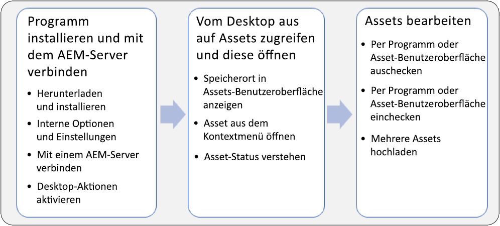
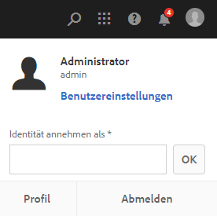
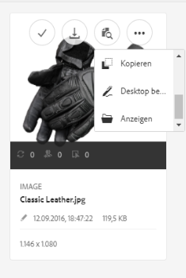

# Verwenden des AEM-Desktop-Programms, v1.x {#use-aem-desktop-app-v1x}

Mithilfe des Programms haben Sie über Ihren lokalen Desktop problemlosen Zugriff auf die Assets in AEM und die Assets können in beliebigen Desktop-Applikationen verwendet werden. Assets können in Mac Finder oder Windows Explorer leicht angezeigt, in Desktop-Applikationen geöffnet und lokal geändert werden. Die Änderungen werden dann wieder unter einer neuen, im Repository erstellten Version in AEM gespeichert.

Dank dieser Integration können unterschiedliche Rollen im Unternehmen die Assets in AEM Assets zentral verwalten und in Creative Cloud und in anderen Applikationen auf sie zugreifen. Gleichzeitig können diverse Standards einschließlich Branding-Vorgaben eingehalten werden.

Zu den Hauptaufgaben, die Sie mit dem AEM-Desktop-Programm v1 ausführen, gehören:

1. [Verbindung zu einem AEM-Server herstellen](#installandconnect)
1. [Assets direkt auf dem Desktop öffnen](#openondesktop)
1. [Assets auf dem Desktop bearbeiten und auschecken](#workonassets)
1. [Assets und Ordner stapelweise hochladen](#bulkupload)

Informationen zu den empfohlenen und nicht empfohlenen Vorgehensweisen finden Sie unter [Best Practices zur Verwendung des Programms](best-practices-for-v1.md). Wenn Sie bei der Verwendung des Programms Probleme haben, finden Sie weitere Informationen unter [Fehlerbehebung für AEM Desktop](troubleshoot-app-v1.md).

>[!NOTE]
>
>Das AEM-Desktop-Programm wurde in der AEM-Version 6.1 unter der Bezeichnung AEM Assets Companion App eingeführt.

## Touchpoints des AEM-Desktop-Programms im kreativen Workflow {#aem-desktop-app-touch-points-in-the-creative-workflow}

Das AEM-Desktop-Programm fügt sich zusammen mit AEM Assets in Ihren kreativen Workflow ein und bietet die folgenden Touchpoints.

Touchpoints des AEM-Desktop-Programms im kreativen Workflow

## Installieren des AEM-Desktop-Programms und Verbinden mit dem AEM-Server {#installandconnect}

Bevor Sie mit der Erstellung oder Bearbeitung von Kreativ-Assets beginnen können, verbinden Sie zunächst das Desktop-Programm mit dem AEM Assets-Server, damit Sie Assets in das Repository hochladen bzw. von dort herunterladen können. Führen Sie die folgenden Aufgaben durch:

1. [Installieren Sie das Programm](#installapp).
1. [Legen Sie Ihre Voreinstellungen](#inapppref) und Verbindungsdetails fest.
1. [Stellen Sie eine Verbindung zu einem AEM-Server her](#connect) und stellen Sie das Asset-Repository als lokales Laufwerk bereit.
1. [Aktivieren Sie Desktop-Aktionen](#desktopactions) auf dem AEM-Server.

Das AEM-Desktop-Programm verwendet eine HTTPS-Verbindung, um eine Verbindung zum AEM-Server herzustellen, damit Ihre Assets sicher übertragen werden.

>[!NOTE]
>
>Möglicherweise benötigen Sie bei einigen oder allen Installations- und Konfigurationsschritten Hilfe von Ihrem AEM-Administrator oder Systemadministrator.

### Installieren des Programms {#installapp}

Stellen Sie für die Verwendung des AEM-Desktop-Programms sicher, dass Ihre AEM-Server-Version vom AEM-Desktop-Programm unterstützt wird. Laden Sie die entsprechende Installationsdatei (binär) für Ihr Betriebssystem (Mac oder Windows) herunter und installieren Sie das Programm.

Je nach Netzwerk- und Systemvoreinstellungen kann eine detaillierte Konfiguration erforderlich sein. Weitere Einzelheiten dazu finden Sie unter [Installieren und Konfigurieren des AEM-Desktop-Programms](install-configure-app-v1.md).

1. Öffnen Sie die [Download-Seite des AEM-Desktop-Programms](https://helpx.adobe.com/de/experience-manager/kb/download-companion-app.html) und laden Sie die entsprechende Binärdatei für Ihr Betriebssystem herunter.
1. Starten Sie die heruntergeladene Installationsdatei und befolgen Sie die Bildschirmanweisungen, um das Programm zu installieren.

   >[!NOTE]
   >
   >Es kann immer nur eine Instanz des AEM-Desktop-Programms installiert und aktiv sein.

### Grundlegendes zu den Optionen und Voreinstellungen des Programms {#inapppref}

Das Programm ermöglicht das Konfigurieren von Einstellungen zum Herstellen und Trennen von Verbindungen zu AEM-Servern, zum Anzeigen des Status von Uploads, zum Verwalten des lokalen Caches usw. Typische Benutzer des Programms können die Standardeinstellungen verwenden. Sie können die Einstellungen anpassen, um die Funktionen des Programms und die Integration mit dem AEM-Server optimal zu nutzen. Die verschiedenen Einstellungen werden im Folgenden detailliert beschrieben.

**Assets durchsuchen** Öffnen Sie das lokale Laufwerk, auf dem das Repository für AEM Assets bereitgestellt wurde. Durchsuchen Sie also die Assets, die Ihnen nun auf Ihrem lokalen Computer zur Verfügung stehen.

**Asset-Status einsehen** Wenn geänderte Assets hochgeladen oder dem AEM Assets-Repository neue Assets hinzugefügt werden, lädt das Programm die Assets im Hintergrund hoch. Der Upload im Hintergrund ermöglicht die reibungslose Ausführung von Vorgängen, ohne dass der Abschluss des Uploads abgewartet werden muss. Dies ist insbesondere bei umfangreichen Assets hilfreich. Sie können die Änderungen lokal speichern und müssen sich nicht mehr darum kümmern. Je nach verfügbarer Bandbreite nimmt das Senden dieser Assets an den Server durch das Programm etwas Zeit in Anspruch. Sie können den Status des Uploads sowie weitere grundlegende Informationen überprüfen.

**Options (Optionen)** Klicken/tippen Sie in der Ablage des AEM-Desktop-Programms auf „Options“ (Optionen), um auf Einstellungen zuzugreifen, mit denen Sie festlegen, ob das Programm beim Systemstart gestartet wird und ob beim Programmstart eine Verbindung zum AEM-Server hergestellt wird. Außerdem können Sie hier den Buchstaben des lokalen Laufwerks ändern, auf dem AEM Assets nach der Bereitstellung verfügbar ist.

**Advanced > Manage cache (Erweitert > Cache verwalten)** Sie können festlegen, wie viel Festplattenspeicher für lokale Caching-Zwecke zur Verfügung gestellt wird. Die Artefakte vom AEM Assets-Server werden für ein reibungsloseres Erlebnis lokal zwischengespeichert. Sie können die Standardeinstellungen Ihren Anforderungen entsprechend anpassen. Außerdem können Sie den Cache löschen, um alle Assets erneut abzurufen. Wenn Sie den Cache löschen, werden nicht gespeicherte Änderungen beibehalten. Alle Assets, die nicht auf dem AEM-Server eingecheckt wurden, werden beibehalten und nicht gelöscht.

### Herstellen einer Verbindung zu einem AEM-Server {#connect}

Das Programm unterstützt die Proxy-Konfiguration unter Mac und Windows. Die Konfiguration wird gelesen, wenn das Programm gestartet wird. Wenn Sie die Proxy-Einstellungen ändern, müssen Sie das Programm neu starten, damit die Änderungen übernommen werden.

>[!NOTE]
>
>Wenn Sie die Proxy-Einstellungen ändern, müssen Sie das Programm neu starten, damit die Änderungen übernommen werden. Andernfalls verwendet das Programm weiterhin den zuvor konfigurierten Proxyserver.

1. Starten Sie das AEM-Desktop-Programm. Wenn Sie Ihre AEM-Instanz dem Programm zuordnen möchten, geben Sie Ihren AEM-Server im folgenden Format an `https://[aem-server-url]:[port]`.

   

1. Geben Sie im Anmeldebildschirm den Benutzernamen und das Kennwort für Ihre Instanz an. Wenn Sie eine alternative AEM-Instanz angeben möchten, wählen Sie die Option **[!UICONTROL Alternate Login URL]** aus.

   

### Aktivieren von Desktop-Aktionen in der AEM-Web-Benutzeroberfläche {#desktopactions}

Über die Assets-Benutzeroberfläche können Sie zu den Asset-Speicherorten navigieren oder Assets auschecken und öffnen, um sie in Ihrem Desktop-Programm zu bearbeiten. Diese Optionen werden als Desktop-Aktionen bezeichnet und sind standardmäßig nicht aktiviert. Führen Sie die folgenden Schritte aus, um sie zu aktivieren.

1. Klicken/tippen Sie in der Assets-Benutzeroberfläche rechts oben in der Symtolleiste auf das Benutzersymbol.
1. Klicken Sie auf **[!UICONTROL My Preferences]**, um das Dialogfeld **[!UICONTROL Preferences]** anzuzeigen.

   

1. Wählen Sie im Dialogfeld „Benutzereinstellungen“ die Option **[!UICONTROL Show Desktop Actions For Assets]**. Klicken Sie auf **[!UICONTROL Accept]**.

   ![Aktivieren Sie [!UICONTROL Show Desktop Actions For Assets], um Desktop-Aktionen zu aktivieren.](assets/enable_desktop_actions.png)

   *Abbildung: Aktivieren von „Desktop-Aktionen für Assets anzeigen“ zur Ermöglichung von Desktop-Aktionen.*

## Zugreifen auf und Öffnen von Assets über den Desktop {#openondesktop}

Wenn Sie auf **Öffnen** klicken, um ein Asset auf einem lokalen Computer zu öffnen, lädt das Programm das Asset in den internen Cache herunter. Das Programm startet das native Desktop-Programm, das dem Dateityp des heruntergeladenen Assets zugeordnet ist.

Wählen Sie auf einem Mac im Kontextmenü die Option **Öffnen** aus, um ein Asset über das AEM-Desktop-Programm zu öffnen. Wählen Sie unter Windows im Kontextmenü die Option „Open on Web“ (Im Web öffnen) aus, um das Asset zu öffnen. Klicken Sie im Fenster „Asset Status“ (Asset-Status) auf das Symbol , bzw. tippen Sie darauf, um das Asset zu öffnen.

Wählen Sie bei Adobe InDesign-Dateien (INDD) im Kontextmenü die Option **[!UICONTROL Open]** aus. Wenn Sie auf diese Option klicken, lädt das Programm die verknüpften Assets in Ihr lokales Dateisystem herunter und öffnet anschließend die INDD-Datei in Adobe InDesign. Mithilfe dieser Methode wird sichergestellt, dass die erforderlichen Assets beim Bearbeiten einer INDD-Datei lokal verfügbar sind.

*Abbildung: Kontextmenüoptionen zum Zugreifen auf und Öffnen von Assets mithilfe des AEM-Desktop-Programms.*

>[!NOTE]
>
>Unter Windows verhindert die [Windows 7-Standardeinstellung](https://support.microsoft.com/de-de/kb/2668751), dass das AEM-Desktop-Programm Dateien verarbeitet, die größer als 50 MB sind.

>[!NOTE]
>
>Adobe empfiehlt in den Finder-Darstellungsoptionen auf dem Mac die Optionen **Objektinfo einblenden**, **Objektvorschau einblenden** und **Vorschau einblenden** für den gemounteten AEM Assets-Ordner zu aktivieren. Dadurch wird die Leistung verbessert.

### Zusätzliche Optionen in der AEM-Benutzeroberfläche {#additional-options-in-aem-assets}

Nachdem Sie Ihrem lokalen Laufwerk das AEM Assets-Repository zugeordnet haben, können Sie zusätzliche Symbole sowie die Funktion „Ordner-Upload“ aktivieren, die für zugeordnete Assets und Ordner angezeigt werden.

1. Öffnen Sie die Benutzeroberfläche von AEM Assets und bewegen Sie den Mauszeiger auf einen Ordner oder ein Asset, um die Desktop-Aktionen in der Kartenansicht in Form von Schnellaktionen anzuzeigen.

   

   *Abbildung: Schnellaktionsmenü in der Assets-Benutzeroberfläche öffnen, um Desktop-Aktionen anzuzeigen.*

   Sie können auch auf diese Desktop-Aktionen zugreifen, indem Sie in der Symbolleiste auf die Option **Desktop-Aktionen** klicken, nachdem Sie das Asset ausgewählt haben. Eine weitere Möglichkeit bietet die Symbolleiste auf der Asset-Seite.

1. Wenn Sie das Asset in der Desktop-Applikation öffnen möchten, die der jeweiligen Dateierweiterung zugeordnet ist, klicken Sie auf die Schnellaktion **Auf dem Desktop öffnen**.

   Alternativ können Sie die Option **Öffnen** über das Menü **Desktop-Aktionen** in der Symbolleiste auswählen.

Um das gewünschte Asset in Ihrem lokalen Dateisystem zu finden, klicken Sie auf die Schnellaktion **Anzeigen** . Alternativ können Sie die Option **Anzeigen** über das Menü **Desktop-Aktionen** in der Symbolleiste auswählen.

## Grundlegendes zu den Asset-Status {#understand-the-asset-statuses}

|  | Das Programm ist mit dem Server verbunden und alle Assets sind synchronisiert. |
--- |--- |
|  | Das Programm wurde gestartet, es ist jedoch nicht mit dem Server verbunden. Bei einigen Assets steht möglicherweise die Synchronisierung aus. |
|  | Assets werden synchronisiert. Dateien werden hoch- oder herunterladen. Im Fenster „Asset Status“ (Asset-Status) können Sie den exakten Status anzeigen und die Übertragungen pausieren. |
|  | Das Programm versucht, eine erneute Verbindung herzustellen. Möglicherweise führen Netzwerkprobleme zur Trennung der Verbindung. |

## Bearbeiten von Assets {#workonassets}

### Auschecken von Assets in der AEM-Web-Benutzeroberfläche {#check-out-assets-from-the-aem-web-interface}

Mit AEM Assets können Sie Assets zum Bearbeiten auschecken und dann wieder einchecken, wenn Sie keine weiteren Änderungen vornehmen möchten. Wenn Sie ein Asset ausgecheckt haben, können nur Sie das Asset bearbeiten, mit Anmerkungen versehen, veröffentlichen, verschieben oder löschen. Durch das Auschecken eines Assets wird das Asset gesperrt und andere Benutzer können derartige Vorgänge nicht durchführen. Um Assets aus-/einchecken zu können, benötigen Sie entsprechenden Schreibzugriff.

Es gibt zwei Methoden zum Auschecken von Assets über die AEM-Web-Benutzeroberfläche. Ausführliche Informationen zur ersten Methode finden Sie unter [Ein- und Auschecken von Dateien über die Assets-Benutzeroberfläche](https://experienceleague.adobe.com/docs/experience-manager-65/assets/managing/check-out-and-submit-assets.html?lang=de). Führen Sie die folgenden Schritte aus, um das Asset anhand der zweiten Methode auszuchecken und zu öffnen, wenn das AEM-Desktop-Programm installiert ist.

1. Öffnen Sie die Benutzeroberfläche von AEM Assets und bewegen Sie den Mauszeiger auf einen Ordner oder ein Asset, um die Desktop-Aktionen in der Kartenansicht in Form von Schnellaktionen anzuzeigen.

   

   Sie können auch auf diese Desktop-Aktionen zugreifen, indem Sie in der Symbolleiste auf das Symbol „Desktop-Aktionen“ klicken/tippen, nachdem Sie das Asset ausgewählt haben. Eine weitere Möglichkeit bietet die Symbolleiste auf der Asset-Seite.

1. Klicken/tippen Sie zum Öffnen des Assets auf die Schnellaktion „Auf dem Desktop öffnen“ .

   Alternativ können Sie die Option „Öffnen“ über das Menü „Desktop-Aktionen“ in der Symbolleiste auswählen.

   >[!NOTE]
   >
   >Wenn Sie eine Datei bearbeiten, die gerade geöffnet ist und nicht ausgecheckt wurde, erfahren andere Benutzer nicht, dass Sie ein Asset aktualisieren.

1. Wenn Sie ein Asset für die Bearbeitung in einer Adobe Creative Cloud-Applikation öffnen möchten, klicken/tippen Sie auf die Schnellaktion . Dadurch wird das Asset auch zur Bearbeitung ausgecheckt. Checken Sie das Asset nach Abschluss der Bearbeitung ein, um die Änderungen in AEM Assets zu aktualisieren.

   Alternativ können Sie die Option „Bearbeiten“ über das Menü „Desktop-Aktionen“ in der Symbolleiste auswählen.

1. Wählen Sie die Menüoption „Öffnen“ aus. Die ausgewählten Assets werden im Vorschaumodus geöffnet.
1. Um die Assets zu bearbeiten, wählen Sie die Option „Bearbeiten“ aus. Die Assets werden im Bearbeitungsmodus geöffnet.

### Auschecken von Assets aus dem Finder unter macOS {#check-out-assets-on-mac}

Mithilfe des Programms können Sie Dateien auschecken, damit andere Benutzer keine Änderungen an den Dateien vornehmen können, an denen Sie gerade arbeiten.

1. Wählen Sie im Mac-Kontextmenü die Option „AEM Assets-Ordner öffnen“ aus, um Finder zu öffnen.

   

   Kontextmenüoptionen zum Zugreifen auf und Öffnen von Assets mithilfe des AEM-Desktop-Programms

1. Navigieren Sie zu dem Asset, das Sie auschecken möchten.
1. Klicken Sie mit der rechten Maustaste auf das Asset und wählen Sie im Kontextmenü die Option „More Assets Info“ (Weitere Asset-Informationen) aus.
1. Klicken/tippen Sie im Dialogfeld „Asset Info“ (Asset-Informationen) auf das Symbol „Auschecken“, um das Asset auszuchecken. Das Symbol „Auschecken“ wird zum Symbol „Einchecken“, nachdem Sie darauf geklickt/getippt haben.

   

1. Wenn Sie das Asset einchecken möchten, sodass es für andere Benutzer verfügbar ist, klicken/tippen Sie im Dialogfeld „Asset Info“ (Asset-Informationen) auf das Symbol „Einchecken“.

### Auschecken von Assets unter Windows {#check-out-assets-on-windows}

Mithilfe des Programms können Sie Dateien auschecken, damit andere Benutzer keine Änderungen an den Dateien vornehmen können, an denen Sie gerade arbeiten.

1. Wählen Sie im Kontextmenü die Option „Explore Assets“ (Assets durchsuchen), um Explorer zu öffnen.
1. Navigieren Sie in Explorer zum Speicherort des Assets, das Sie auschecken möchten.
1. Klicken Sie mit der rechten Maustaste auf das Asset und wählen Sie aus dem Kontextmenü die Option „Open on Web“ (Im Web öffnen) aus.
1. Klicken/tippen Sie im Dialogfeld „Asset Info“ (Asset-Informationen) auf das Symbol „Checkout“ (Auschecken). Das Symbol „Auschecken“ wird zum Symbol „Einchecken“

   

1. Prüfen Sie das Asset in Explorer. Das Sperrsymbol auf dem Asset  gibt an, dass Sie das Asset ausgecheckt haben.

   >[!NOTE]
   >
   >Das Schlosssymbol wird möglicherweise mit einiger Verzögerung angezeigt. Das AEM-Desktop-Programm speichert die Assets für einen schnellen Zugriff zwischen. Daher kann es einen Moment dauern, bis der Sperrstatus aktualisiert wird.

1. Wenn Sie das Asset einchecken möchten, sodass es für andere Benutzer verfügbar ist, klicken/tippen Sie im Dialogfeld **Asset Info** (Asset-Informationen) auf das Symbol „Einchecken“.

### Einchecken eines Assets mit Finder oder Explorer und der Web-Benutzeroberfläche {#check-in-an-asset-using-finder-or-explorer-and-using-web-interface}

Wenn Sie mit dem Bearbeiten der Assets fertig sind, speichern Sie sie in Ihrem Desktop-Programm. Wählen Sie im Kontextmenü die Option **Weitere Asset-Informationen** aus und klicken/tippen Sie auf „Einchecken“.

Die Assets werden auf den AEM-Server hochgeladen. Optional können Sie den Status des Uploads überprüfen, indem Sie unter dem Ablagesymbol die Option **Asset-Status anzeigen** auswählen. Alternativ können Sie ein Asset über die AEM-Web-Benutzeroberfläche einchecken. Klicken Sie auf die ausgecheckten Assets oder wählen Sie sie aus. Klicken Sie in der Symbolleiste auf das Symbol .

Ein Asset wird automatisch in AEM hochgeladen, nachdem die Änderungen lokal gespeichert wurden. Durch das Einchecken wird das Asset anderen AEM-Benutzern zur Bearbeitung zur Verfügung gestellt.

### Massen-Upload von Assets und Ordnern auf den AEM-Server {#bulkupload}

Mit AEM Desktop können Sie einen ganzen Ordner mit Assets aus Ihrem lokalen Dateiverzeichnis in AEM Assets hochladen. Auf diese Weise werden alle Assets innerhalb des Ordners gemeinsam hochgeladen und Sie müssen sie nicht einzeln hochladen.

1. Klicken/tippen Sie in der Symbolleiste der Assets-Benutzeroberfläche auf **Erstellen** und wählen Sie die Option **Ordner hochladen** aus dem Menü aus.
1. Navigieren Sie zu dem Ordner, den Sie hochladen möchten, und wählen Sie ihn aus.
1. Klicken/tippen Sie auf „OK“. Im Dialogfeld „Asset Status“ (Asset-Status) wird der Status des Uploads angezeigt.

   

   Status des Uploads im Fenster „Assets Status“ anzeigen

   >[!NOTE]
   >
   >Sie können den Upload manuell pausieren oder abbrechen, indem Sie auf das entsprechende Symbol klicken/tippen.

1. Wenn der Upload abgeschlossen ist, schließen Sie das Dialogfeld und navigieren Sie zur Assets-Benutzeroberfläche. Der hochgeladene Ordner wird in der Web-Benutzeroberfläche angezeigt.

Adobe empfiehlt nicht, eine größere Anzahl von Dateien oder verschachtelten Ordnern aus dem lokalen Dateisystem zu kopieren und in den Freigabebereich des Netzwerks einzufügen. Das Programm kann den Upload-Vorgang aufgrund technischer Einschränkungen nicht steuern und die Leistung ist schlecht.

Alternativ können Sie Dateien/Ordner, die Sie in AEM hochladen möchten, im Finder oder Explorer auswählen, sie in die Systemzwischenablage kopieren, zum Zielordner im Freigabebereich des Netzwerks navigieren und im Kontextmenü des AEM-Desktop-Programms die Option **Assets einfügen** wählen. Dadurch beginnt das AEM-Desktop-Programm mit dem Upload der eingefügten Assets, ähnlich wie bei der Option **Ordner hochladen** in der AEM-Web-Benutzeroberfläche.

>[!MORELIKETHIS]
>
>* [Fehlerbehebung für das AEM-Desktop-Programm](troubleshoot-app-v1.md)

