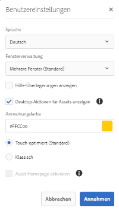
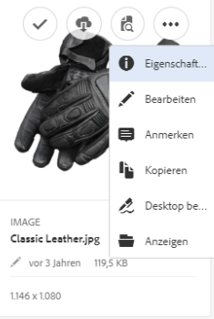
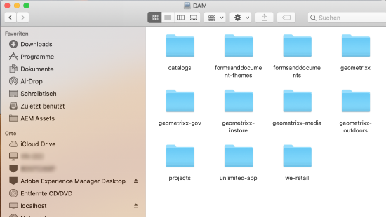
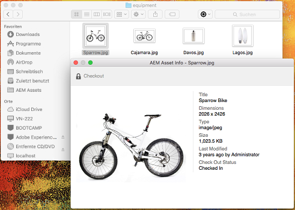
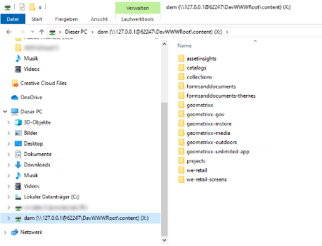
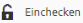

# Verwenden der AEM Desktop-App Version 1.x {#use-aem-desktop-app-v1x}

Mithilfe der App haben Sie über Ihren lokalen Desktop problemlosen Zugriff auf die Assets in AEM und die Assets können in beliebigen Desktop-Applikationen verwendet werden. Assets können einfach in Mac Finder oder Windows Explorer angezeigt, in Desktop-Anwendungen geöffnet und lokal geändert werden - die Änderungen werden mit einer neuen Version, die im Repository erstellt wurde, wieder in AEM gespeichert.

Dank dieser Integration können unterschiedliche Rollen im Unternehmen die Assets in AEM Assets zentral verwalten und in Creative Cloud und in anderen Applikationen auf sie zugreifen. Gleichzeitig können diverse Standards einschließlich Branding-Vorgaben eingehalten werden.

Zu den Hauptaufgaben, die Sie mit der AEM-Desktop-App Version 1 ausführen, gehören:

* [Verbindung zu einem AEM-Server herstellen](#installandconnect)

* [Assets direkt auf dem Desktop öffnen](#openondesktop)
* [Assets auf dem Desktop bearbeiten und auschecken](#workonassets)

* [Assets und Ordner stapelweise hochladen](#bulkupload)

Informationen zu den empfohlenen und nicht empfohlenen Vorgehensweisen finden Sie unter [Best Practices zur Verwendung der App](best-practices-for-v1.md). Wenn Sie bei der Verwendung der App Probleme haben, finden Sie weitere Informationen unter [Fehlerbehebung für AEM Desktop](troubleshoot-app-v1.md). 

>[!NOTE]
>Die AEM-Desktop-App wurde in der Version AEM 6.1 eingeführt und als AEM Assets Companion App bezeichnet.

## Touchpoints der AEM Desktop App im kreativen Workflow {#aem-desktop-app-touch-points-in-the-creative-workflow}

Die AEM Desktop App fügt sich zusammen mit AEM Assets in Ihren kreativen Workflow ein und bietet die folgenden Touchpoints.

Touchpoints der AEM Desktop App im kreativen Workflow

## Install and connect AEM desktop app to AEM server {#installandconnect}

Bevor Sie mit der Erstellung oder Bearbeitung von Kreativ-Assets beginnen können, verbinden Sie zunächst die Desktop App mit dem AEM Assets-Server, damit Sie Assets in das Repository hochladen bzw. von dort herunterladen können. Führen Sie die folgenden Aufgaben durch:

1. [Installieren Sie die App](#installapp).
1. [Legen Sie Ihre Voreinstellungen](#inapppref) und Verbindungsdetails fest.
1. [Stellen Sie eine Verbindung zu einem AEM-Server her](#connect) und stellen Sie das Asset-Repository als lokales Laufwerk bereit.
1. [Aktivieren Sie Desktop-Aktionen](#desktopactions) auf dem AEM-Server.

Die AEM-Desktop-App verwendet eine HTTPS-Verbindung, um eine Verbindung zum AEM-Server herzustellen, um Ihre Assets zuverlässig und sicher zu übertragen.

>[!NOTE]
>Möglicherweise benötigen Sie bei einigen oder allen Installations- und Konfigurationsschritten Hilfe von Ihrem AEM-Administrator oder Systemadministrator.

### Installieren der Applikation {#installapp}

Um die AEM-Desktop-App zu verwenden, stellen Sie sicher, dass Ihre AEM-Serverversion von der AEM Desktop-App unterstützt wird. Laden Sie die entsprechende Installationsdatei (binär) für Ihr Betriebssystem (Mac oder Windows) herunter und installieren Sie die App.

Eine detaillierte Konfiguration kann je nach Netzwerk- und Systemeinstellungen erforderlich sein. Weitere Einzelheiten dazu finden Sie unter [Installieren und Konfigurieren der AEM Desktop App](install-configure-app-v1.md). 

1. Go to the [AEM Desktop app download page](https://helpx.adobe.com/experience-manager/kb/download-companion-app.html) and download the appropriate binary for your operating system.
1. Starten Sie die heruntergeladene Installationsdatei und befolgen Sie die Bildschirmanweisungen, um die App zu installieren.

   >[!NOTE]
   >Es kann jeweils nur eine Instanz der AEM-Desktop-App installiert und aktiv sein.

### Grundlegendes zu den Optionen und Voreinstellungen der App {#inapppref}

Die Applikation ermöglicht das Konfigurieren von Einstellungen zum Herstellen und Trennen von Verbindungen zu AEM-Servern, zum Anzeigen des Status von Uploads, zum Verwalten des lokalen Caches usw. Typische Benutzer der Applikation können die Standardeinstellungen verwenden. Sie können die Einstellungen anpassen, um die Funktionen der Applikation und die Integration mit dem AEM-Server optimal zu nutzen. Die verschiedenen Einstellungen werden im Folgenden detailliert beschrieben.

**Assets** durchsuchen Öffnen Sie das lokale Laufwerk, auf dem das AEM Assets-Repository gemountet ist. Durchsuchen Sie also die Assets, die Ihnen nun auf Ihrem lokalen Computer zur Verfügung stehen.

**Asset-Status** anzeigen Wenn geänderte Assets hochgeladen oder neue Assets zum AEM Assets-Repository hinzugefügt werden, lädt die Anwendung die Assets im Hintergrund hoch. Der Upload im Hintergrund ermöglicht die reibungslose Ausführung von Vorgängen, ohne dass der Abschluss des Uploads abgewartet werden muss. Dies ist insbesondere bei umfangreichen Assets hilfreich. Sie können die Änderungen lokal speichern und müssen sich nicht mehr darum kümmern. Je nach verfügbarer Bandbreite nimmt das Senden dieser Assets an den Server durch die Applikation etwas Zeit in Anspruch. Sie können den Status des Uploads sowie weitere grundlegende Informationen überprüfen.

**Optionen** Klicken Sie auf Optionen aus dem AEM Desktop-App-Ablage, um auf Einstellungen zuzugreifen und die Anwendung beim Starten des Systems zu starten. Verbindung zum AEM-Server beim Starten der App herstellen; und um den lokalen Laufwerksbuchstaben zu ändern, in dem AEM Assets nach dem Einbau verfügbar sind.

**Erweitert &gt; Cache** verwalten Sie können steuern, wie viel Speicherplatz für lokale Zwischenspeicherung zur Verfügung steht. Die Artefakte vom AEM Assets-Server werden für ein reibungsloseres Erlebnis lokal zwischengespeichert. Sie können die Standardeinstellungen Ihren Anforderungen entsprechend anpassen. Außerdem können Sie den Cache löschen, um alle Assets erneut abzurufen. Wenn Sie den Cache löschen, werden nicht gespeicherte Änderungen beibehalten. Alle Elemente, die nicht auf dem AEM-Server eingecheckt wurden, werden beibehalten und nicht gelöscht.

### Herstellen einer Verbindung zu einem AEM-Server {#connect}

Die App unterstützt die Proxykonfiguration unter Mac und Windows. Die Konfiguration wird gelesen, wenn die App gestartet wird. Wenn Sie die Proxy-Einstellungen ändern, müssen Sie die App neu starten, damit die Änderungen übernommen werden.

>[!NOTE]
>
>Wenn Sie die Proxy-Einstellungen ändern, starten Sie die App neu, damit die Änderungen wirksam werden. Andernfalls verwendet die App weiterhin den zuvor konfigurierten Proxyserver.

1. Starten Sie die AEM Desktop App. To map your AEM instance with the app, specify your AEM server in the format `https://[aem-server-url]:[port]`.

   

1. Geben Sie im Anmeldebildschirm den Benutzernamen und das Kennwort für Ihre Instanz an. To specify an alternate AEM instance, select the **[!UICONTROL Alternate Login URL]** option.

   

### Aktivieren von Desktop-Aktionen in der AEM-Webbenutzeroberfläche {#desktopactions}

Über die Assets-Benutzeroberfläche in einem Browser können Sie zu den Asset-Speicherorten navigieren oder Assets auschecken und öffnen, um sie in Ihrer Desktop-Applikation zu bearbeiten. Diese Optionen werden als Desktop-Aktionen bezeichnet und sind standardmäßig nicht aktiviert. Führen Sie die folgenden Schritte aus, um sie zu aktivieren.

1. In the Assets console, click/tap the **User** icon from the toolbar.
1. Klicken Sie auf die Schaltfläche **[!UICONTROL My Preferences]** , um das **[!UICONTROL Preferences]** Dialogfeld anzuzeigen.
1. Wählen Sie im Dialogfeld "Benutzereinstellungen" **[!UICONTROL Show Desktop Actions For Assets]**. Klicken/Tippen **[!UICONTROL Accept]**.

   

   „Desktop-Aktionen für Assets anzeigen“ aktivieren, um Desktop-Aktionen zu ermöglichen

## Zugreifen auf und Öffnen von Assets über den Desktop {#openondesktop}

>[!NOTE]
>On Windows, the [default Windows 7 setting](https://support.microsoft.com/en-us/kb/2668751) prevents AEM desktop app from handling assets that are larger than 50 MB.

### Anzeigen des Speicherorts zugeordneter Assets über die AEM-Webbenutzeroberfläche {#reveal-the-location-of-mapped-assets-from-aem-web-interface}

Nachdem Sie Ihrem lokalen Laufwerk das AEM Assets-Repository zugeordnet haben, können Sie zusätzliche Symbole sowie die Funktion „Ordner-Upload“ aktivieren, die für zugeordnete Assets und Ordner angezeigt werden.

1. Öffnen Sie die Benutzeroberfläche von AEM Assets und bewegen Sie den Mauszeiger auf einen Ordner oder ein Asset, um die Desktop-Aktionen in der Kartenansicht in Form von Schnellaktionen anzuzeigen.

   

   Schnellaktionsmenü auf der Assets-Benutzeroberfläche öffnen, um Desktop-Aktionen anzuzeigen

   Sie können auch auf diese Desktop-Aktionen zugreifen, indem Sie auf das Symbol **Desktop-Aktionen** in der Symbolleiste klicken/tippen, nachdem Sie das Asset ausgewählt haben. Eine weitere Möglichkeit bietet die Symbolleiste auf der Asset-Seite.

1. To open the asset in the desktop application that is associated with the specific file extension, click/tap the **Open on desktop** quick action .

   Alternativ können Sie die Option **Öffnen** über das Menü **Desktop-Aktionen** in der Symbolleiste auswählen.

1. Click/tap the **Reveal** quick action  to locate the particular asset on your local file system.

   Alternatively, choose **Reveal** from the **Desktop Actions** menu in the toolbar.

### Öffnen von AEM Assets über Finder oder Explorer {#open-aem-assets-from-the-finder-or-the-explorer}

Wählen Sie auf einem Mac im Kontextmenü die Option „Öffnen“ aus, um ein Asset über AEM Desktop zu öffnen.

For Adobe InDesign (INDD) files, select **[!UICONTROL Open]** from the context menu. Wenn Sie auf diese Option klicken, lädt die App die verknüpften Assets in Ihr lokales Dateisystem herunter und öffnet dann die INDD-Datei in Adobe InDesign. Diese Methode stellt sicher, dass die erforderlichen Assets beim Bearbeiten der INDD-Datei lokal verfügbar sind.

Wählen Sie unter Windows im Kontextmenü die Option „Open on Web“ (Im Web öffnen) aus, um das Asset zu öffnen. Klicken Sie im Fenster "Asset-Status"auf das Symbol "Auf dem Desktop  .

Kontextmenüoptionen zum Zugreifen auf und Öffnen von Assets mithilfe der AEM Desktop App

### Grundlegendes zu den Asset-Status {#understand-the-asset-statuses}

|  | Die App ist mit dem Server verbunden und alle Assets sind synchronisiert. |
|------|-----------------------------------------------------------------------------------------------------------------------------------------------------------|
|  | Die App wurde gestartet, sie ist jedoch nicht mit dem Server verbunden. Bei einigen Assets steht möglicherweise die Synchronisierung aus. |
|  | Assets werden synchronisiert. Dateien werden hoch- oder herunterladen. Im Fenster „Asset Status“ (Asset-Status) können Sie den exakten Status anzeigen und die Übertragungen pausieren. |
|  | Die App versucht, eine erneute Verbindung herzustellen. Möglicherweise führen Netzwerkprobleme zur Trennung der Verbindung. |

## Bearbeiten von Assets {#workonassets}

### Auschecken von Assets in der AEM-Webbenutzeroberfläche {#check-out-assets-from-the-aem-web-interface}

Mit AEM Assets können Sie Assets zum Bearbeiten auschecken und dann wieder einchecken, wenn Sie keine weiteren Änderungen vornehmen möchten. Wenn Sie ein Asset ausgecheckt haben, können Sie allein das Asset bearbeiten, mit Anmerkungen versehen, veröffentlichen, verschieben oder löschen. Durch das Auschecken eines Assets wird das Asset gesperrt und andere Benutzer werden daran gehindert, diese Vorgänge auszuführen. Um Assets aus-/einchecken zu können, benötigen Sie entsprechenden Schreibzugriff.

Es gibt zwei Methoden zum Auschecken von Assets über die AEM-Webbenutzeroberfläche. Ausführliche Informationen zur ersten Methode finden Sie unter [Ein- und Auschecken von Dateien über die Assets-Benutzeroberfläche](https://helpx.adobe.com/in/experience-manager/6-4/assets/using/check-out-and-submit-assets.html). Führen Sie die folgenden Schritte aus, um das Asset anhand der zweiten Methode auszuchecken und zu öffnen, wenn die AEM Desktop App installiert ist.

1. Öffnen Sie die Benutzeroberfläche von AEM Assets und bewegen Sie den Mauszeiger auf einen Ordner oder ein Asset, um die Desktop-Aktionen in der Kartenansicht in Form von Schnellaktionen anzuzeigen.

   

   Sie können auch auf diese Desktop-Aktionen zugreifen, indem Sie auf das Symbol Desktop-Aktionen in der Symbolleiste klicken/tippen, nachdem Sie das Asset ausgewählt haben. Eine weitere Möglichkeit bietet die Symbolleiste auf der Asset-Seite.

1. To open the asset, click/tap the Open on desktop quick action .

   Alternativ können Sie die Option „Öffnen“ über das Menü „Desktop-Aktionen“ in der Symbolleiste auswählen.

   >[!NOTE]
   >Wenn Sie eine Datei bearbeiten, die gerade geöffnet ist und nicht ausgecheckt wurde, erfahren andere Benutzer nicht, dass Sie ein Asset aktualisieren.

1. To open an asset for editing in an Adobe Creative Cloud application, click/tap the Edit desktop quick action . Dadurch wird auch das Asset zur Bearbeitung ausgecheckt. Checken Sie das Asset nach Abschluss der Bearbeitung ein, um die Änderungen in AEM Assets zu aktualisieren.

   Alternativ können Sie auch im Menü "Desktop-Aktionen"in der Symbolleiste "Bearbeiten"wählen.

1. Wählen Sie die Menüoption Öffnen. Die ausgewählten Assets werden im Vorschaumodus geöffnet.
1. Um die Assets zu bearbeiten, wählen Sie die Option "Bearbeiten". Die Assets werden im Bearbeitungsmodus geöffnet.

### Auschecken von Assets unter Mac {#check-out-assets-on-mac}

Mit der App können Sie Asset-Dateien auschecken, um zu verhindern, dass andere Benutzer die Dateien ändern, an denen Sie arbeiten.

1. Wählen Sie im Mac-Kontextmenü den Befehl AEM Assets-Ordner öffnen, um den Finder zu öffnen.

   

   Kontextmenüoptionen zum Zugreifen auf und Öffnen von Assets mithilfe der AEM Desktop App

1. Navigieren Sie zu dem Asset, das Sie auschecken möchten.

   

1. Klicken Sie mit der rechten Maustaste auf das Asset und wählen Sie im Kontextmenü die Option „More Assets Info“ (Weitere Asset-Informationen) aus.
1. Klicken Sie im Dialogfeld "Asset-Informationen"auf das Symbol zum Auschecken, um das Asset auszuchecken. Das Kassengangsymbol wechselt zum Symbol "Checkin", nachdem Sie darauf geklickt/getippt haben.

   

1. Wenn Sie das Asset einchecken möchten, sodass es für andere Benutzer verfügbar ist, klicken/tippen Sie im Dialogfeld Asset Info (Asset-Informationen) auf das Symbol „Checkin“ (Einchecken).

### Auschecken von Assets unter Windows {#check-out-assets-on-windows}

Mit der App können Sie Asset-Dateien auschecken, um zu verhindern, dass andere Benutzer die Dateien ändern, an denen Sie arbeiten.

1. Wählen Sie im Kontextmenü die Option „Explore Assets“ (Assets durchsuchen), um Explorer zu öffnen.
1. Navigieren Sie in Explorer zum Speicherort des Assets, das Sie auschecken möchten.

   

1. Klicken Sie mit der rechten Maustaste auf das Asset und wählen Sie aus dem Kontextmenü die Option „Open on Web“ (Im Web öffnen) aus.
1. Klicken/tippen Sie im Dialogfeld „Asset Info“ (Asset-Informationen) auf das Symbol „Checkout“ (Auschecken). Das Symbol Kasse wechselt zum Symbol Checkin.

   

1. Prüfen Sie das Asset in Explorer. The lock icon on the asset  indicates that you have checked out the asset.

   >[!NOTE]
   >Das Sperrsymbol wird möglicherweise mit einigen Minuten Verzögerung angezeigt. Die AEM Desktop App speichert die Assets für einen schnellen Zugriff zwischen. Daher kann es einen Moment dauern, bis der Sperrstatus aktualisiert wird.

1. Wenn Sie das Asset einchecken möchten, sodass es für andere Benutzer verfügbar ist, klicken/tippen Sie im Dialogfeld **Asset Info** (Asset-Informationen) auf das Symbol „Checkin“ (Einchecken).

### Einchecken eines Assets mit Finder oder Explorer und der Webbenutzeroberfläche {#check-in-an-asset-using-finder-or-explorer-and-using-web-interface}

Wenn Sie mit dem Bearbeiten der Assets fertig sind, speichern Sie sie in Ihrer Desktop-Applikation. Wählen Sie im Kontextmenü die Option „More Assets Info“ (Weitere Asset-Informationen) aus und klicken/tippen Sie auf „Checkin“ (Einchecken).

Die Assets werden auf den AEM-Server hochgeladen. Optional können Sie den Status des Uploads überprüfen, indem Sie im Ablagensymbol "Asset-Status anzeigen"wählen.

Alternativ können Sie ein Asset über die AEM-Webbenutzeroberfläche einchecken. Klicken/tippen Sie auf die ausgecheckten Assets oder wählen Sie sie aus. From the toolbar, click/tap the check in icon .

### Massen-Upload von Assets und Ordnern auf den AEM-Server {#bulkupload}

Mit AEM Desktop können Sie einen ganzen Ordner mit Assets aus Ihrem lokalen Dateiverzeichnis in AEM Assets hochladen. Auf diese Weise werden alle Assets innerhalb des Ordners gemeinsam hochgeladen und Sie müssen sie nicht einzeln hochladen.

1. Klicken/tippen Sie in der Symbolleiste der Assets-UI auf **Erstellen** und wählen Sie die Option **Ordner hochladen** aus dem Menü aus.
1. Navigieren Sie zu dem Ordner, den Sie hochladen möchten, und wählen Sie ihn aus.
1. Klicken/tippen Sie auf „OK“. Im Dialogfeld „Asset Status“ (Asset-Status) wird der Status des Uploads angezeigt.

   

   Status des Uploads im Fenster „Assets Status“ anzeigen

   >[!NOTE]
   >Sie können den Upload manuell pausieren oder abbrechen, indem Sie auf das entsprechende Symbol klicken/tippen.

1. Wenn der Upload abgeschlossen ist, schließen Sie das Dialogfeld und navigieren Sie zur Assets-Benutzeroberfläche. Der hochgeladene Ordner wird in der Webbenutzeroberfläche angezeigt.

Please note that it is *not recommended* to copy &amp; paste or drag &amp; drop larger number of files / nested folders from your local disk in Finder or Explorer into the network share area that is mapped by AEM desktop app. Diese Methode ist weniger zuverlässig als die zuvor beschriebene Funktion „Ordner hochladen“.

Eine andere Möglichkeit, wenn Sie lieber auf dem Desktop arbeiten möchten, besteht darin, Dateien/Ordner auszuwählen, die Sie in AEM im Finder oder Explorer hochladen möchten, sie in die Systemzwischenablage zu kopieren und dann zum Zielordner im Bereich "Network Share"zu navigieren und im Kontextmenü der AEM-Desktop-App "Assets einfügen"zu wählen. Auf diese Weise beginnt die AEM-Desktop-App mit dem Hochladen der eingefügten Assets, ähnlich dem oben beschriebenen Ordner für das Hochladen.

>[!MORELIKETHIS]
>
>* [Einführung in die AEM-Desktop-App](https://helpx.adobe.com/experience-manager/kt/eseminars/ccoo-aem-desktop-app.html)
>* [Einchecken/Auschecken mit der AEM-Desktop-App](https://helpx.adobe.com/experience-manager/kt/assets/using/checkin-checkout-technical-video-understand.html)
>* [Fehlerbehebung für die AEM Desktop App](troubleshoot-app-v1.md)

