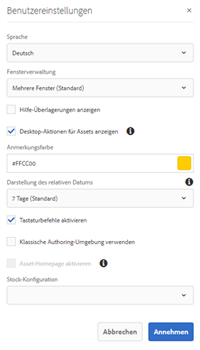
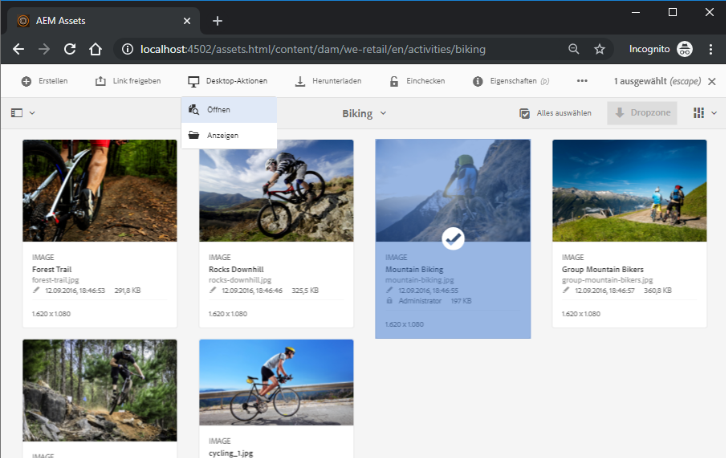

# Verwenden Sie die [!DNL Adobe Experience Manager] Desktop-App {#use-aem-desktop-app-v2}

Verwenden Sie die Desktop-App [!DNL Adobe Experience Manager], um einfach auf die Adobe Experience Manager DAM-Assets auf Ihrem lokalen Desktop zuzugreifen und diese Assets in allen Desktop-Anwendungen zu verwenden. Sie können die Assets in Desktop-Applikationen öffnen und lokal bearbeiten. Laden Sie die Änderungen mit Versionskontrolle zurück in Experience Manager, um sie für andere Benutzer freizugeben. Sie können auch neue Dateien und Ordnerhierarchien in Experience Manager hochladen, Ordner erstellen und Assets oder Ordner aus Experience Manager DAM löschen.

Die Integration ermöglicht es verschiedenen Rollen in der Organisation, die Assets zentral in Experience Manager Assets zu verwalten und auf die Assets auf dem lokalen Desktop in den nativen Applikationen unter Windows oder macOS zuzugreifen.

Wenn Sie das Programm nach dem Abmelden zum ersten Mal öffnen, geben Sie die URL des Experience Manager-Servers in folgendem Format ein: `https://[aem-server-url]:[port]/`. Wählen Sie dann die Option [!UICONTROL Connect] aus. Geben Sie Ihre Anmeldeinformationen ein, um das Programm mit dem Server zu verbinden.

Die wichtigsten Aufgaben, die Sie mit dem Experience Manager-Desktop-Programm ausführen, sind:

![Workflows und Aufgaben, die Sie mit dem [!DNL Experience Manager]-Desktop-Programm ausführen können](assets/aem_desktop_app_usecases_v2.png "Workflows und Aufgaben, die Sie mit dem Adobe Experience Manager-Desktop-Programm ausführen können")
Laden Sie [diese](assets/aem_desktop_app_usecases_print.pdf) druckfertige PDF-Datei herunter.

## Funktionsweise des Desktop-Programms {#how-app-works2}

Bevor Sie mit der Nutzung des Programms beginnen, sollten Sie wissen, [wie das Programm funktioniert](release-notes.md#how-app-works). Machen Sie sich auch mit den folgenden Begriffen vertraut:

* **[!UICONTROL Desktop Actions]**: Über die Assets-Benutzeroberfläche in einem Browser können Sie zu den Asset-Speicherorten navigieren oder Assets auschecken und öffnen, um sie in Ihrer nativen Desktop-Applikation zu bearbeiten. Diese Aktionen sind über die Web-Oberfläche verfügbar und verwenden die Funktionalität des Desktop-Programms. Erfahren Sie, [wie Sie Desktop-Aktionen aktivieren](using.md#desktopactions-v2).

* Dateistatus **[!UICONTROL Cloud Only]**: Solche Assets werden nicht auf den lokalen Computer heruntergeladen und stehen nur auf dem Experience Manager-Server zur Verfügung.

* Dateistatus **[!UICONTROL Available locally]**: Die Assets werden wie bisher heruntergeladen und stehen auf dem lokalen Computer zur Verfügung. Die Assets werden nicht geändert.

* Dateistatus **[!UICONTROL Edited locally]**: Diese Assets werden lokal geändert und die Änderungen bleiben beim Hochladen auf den Experience Manager-Server erhalten. Nach dem Hochladen ändert sich der Status in [!UICONTROL Available locally]. Siehe [Bearbeiten von Assets](using.md#edit-assets-upload-updated-assets).

* Dateistatus **[!UICONTROL Editing conflict]**: Wenn Sie und andere Benutzer ein Asset gleichzeitig ändern, zeigt das Programm an, dass ein Bearbeitungskonflikt aufgetreten ist. Das Programm bietet außerdem Optionen zum Beibehalten oder Verwerfen Ihrer Änderungen. Erfahren Sie, [wie Sie Bearbeitungskonflikte vermeiden](using.md#adv-workflow-collaborate-avoid-conflicts).

* Dateistatus **[!UICONTROL Modified remotely]**: Das Programm gibt an, ob ein heruntergeladenes Asset auf dem Experience Manager-Server geändert wurde. Das Programm bietet auch die Möglichkeit, die neueste Version herunterzuladen und Ihre lokale Kopie zu aktualisieren. Erfahren Sie, [wie Sie Bearbeitungskonflikte vermeiden](using.md#adv-workflow-collaborate-avoid-conflicts).

* **[!UICONTROL Check-out]**: Wenn Sie eine Datei bearbeiten oder eine Datei bearbeiten möchten, können Sie den Status „Auschecken“ aktivieren. Es wird ein Sperrsymbol für das Asset in der App- und Experience Manager-Weboberfläche hinzugefügt. Das Sperrsymbol zeigt anderen Benutzern an, dass sie dasselbe Asset nicht gleichzeitig bearbeiten sollen, da dies zu einem Bearbeitungskonflikt führt.

* **[!UICONTROL Check-in]**: Markieren Sie das Asset als sicher, damit andere Benutzer es bearbeiten können, ohne dass ein Bearbeitungskonflikt entsteht. Wenn Sie Ihre Änderungen hochladen, wird das Sperrsymbol automatisch entfernt. Durch das Deaktivieren des Status „Einchecken“ wird auch das Sperrsymbol entfernt. Es wird jedoch empfohlen, nicht manuell einzuchecken, ohne die Änderungen hochzuladen. Wenn Sie Ihre Änderungen verwerfen, können Sie den Status „Einchecken“ manuell deaktivieren.

* Aktion **[!UICONTROL Open]**: Öffnen Sie einfach das Asset zur Vorschau in der nativen Applikation. Es wird nicht empfohlen, das Asset mit dieser Aktion zu bearbeiten, da das Asset nicht ausgecheckt wird und andere Benutzer Änderungen vornehmen können, die zu Bearbeitungskonflikten führen.

* Aktion **[!UICONTROL Edit]**: Verwenden Sie die Aktion, um das Bild zu ändern. Durch Klicken auf die Aktion [!UICONTROL Edit] wird das Asset automatisch ausgecheckt und ein Sperrsymbol für das Asset hinzugefügt. Wenn Sie nach dem Klicken auf „Edit“ (Bearbeiten) das Asset nicht bearbeiten möchten, klicken Sie auf [!UICONTROL Toggle check-in]. Verwenden Sie zum Löschen, Umbenennen oder Verschieben von Assets in der DAM-Ordnerhierarchie des Experience Managers die Weboberflächenaktionen des Experience Managers und nicht die Bearbeitungsaktion.

* Aktion **[!UICONTROL Download]**: Laden Sie das Asset auf Ihren lokalen Computer herunter. Sie können die Assets jetzt herunterladen und später bearbeiten. Arbeiten Sie offline und laden Sie die Änderungen später hoch. Assets werden in einen Cache-Ordner auf Ihrem Dateisystem heruntergeladen.

* Aktion **[!UICONTROL Reveal File]** oder **[!UICONTROL Reveal Folder]**: Während die Assets in einen lokalen Cache-Ordner heruntergeladen werden, imitiert das Programm ein lokales Netzwerklaufwerk und stellt für jedes Asset einen lokalen Pfad bereit. Um diesen Pfad zu ermitteln, verwenden Sie die entsprechende Einblendeoption im Programm. Zum Platzieren von Assets in der Creative Cloud-Applikation ist die Aktion „Reveal“ (Anzeigen) erforderlich. Siehe [Platzieren von Assets](using.md#place-assets-in-native-documents).

* **[!UICONTROL Open In Web]** Aktion: Um das Asset in der Experience Manager-Weboberfläche Ansicht, öffnen Sie es im Web. Sie können mehr Workflows über die Benutzeroberfläche des Experience Managers auslösen, z. B. durch Aktualisieren von Metadaten oder die Asset-Suche.

* **[!UICONTROL Delete]** Aktion: Löschen Sie das Asset aus dem DAM-Repository des Experience Managers. Dadurch wird die Originalkopie des Assets auf dem Experience Manager-Server gelöscht. Wenn Sie nur Änderungen am lokalen Asset verwerfen möchten, lesen Sie [Verwerfen von Änderungen](using.md#edit-assets-upload-updated-assets).

* **[!UICONTROL Upload Changes]**: Die Desktop-App lädt das aktualisierte Asset nur hoch, wenn Sie es explizit auf den Experience Manager-Server hochladen. Wenn Sie Ihre Änderungen speichern, werden diese nur auf Ihrem lokalen Computer gespeichert. Beim Hochladen wird das Asset automatisch eingecheckt und das Sperrsymbol entfernt. Siehe [Bearbeiten von Assets](using.md#edit-assets-upload-updated-assets).

## Aktivieren von Desktop-Aktionen in der Experience Manager-Weboberfläche {#desktopactions-v2}

Über die Assets-Benutzeroberfläche in einem Browser können Sie zu den Asset-Speicherorten navigieren oder Assets auschecken und öffnen, um sie in Ihrem Desktop-Programm zu bearbeiten. Diese Optionen werden als [!UICONTROL Desktop Actions] bezeichnet und sind standardmäßig nicht aktiviert. Gehen Sie zur Aktivierung wie folgt vor.

1. Klicken/tippen Sie in der Assets-Konsole in der Symbolleiste auf das Symbol **[!UICONTROL User]**.
1. Klicken Sie auf die Schaltfläche **[!UICONTROL My Preferences]**, um das Dialogfeld **[!UICONTROL Preferences]** anzuzeigen.
1. Wählen Sie im Dialogfeld „Benutzereinstellungen“ die Option **[!UICONTROL Show Desktop Actions For Assets]**. Klicken/tippen Sie auf **[!UICONTROL Accept]**.

   

   Aktivieren Sie [!UICONTROL Show Desktop Actions For Assets], um Desktop-Aktionen zu aktivieren.

## Durchsuchen, Suchen und Anzeigen einer Vorschau von Assets {#browse-search-preview-assets}

Sie können die im Experience Manager-Repository verfügbaren Assets innerhalb der Desktop-Anwendung durchsuchen, suchen und in Vorschau setzen. Versuchen Sie Folgendes im Programm:

1. Navigieren Sie zu einem Ordner und sehen Sie einige grundlegende Informationen zu den im Ordner verfügbaren Assets sowie kleine Miniaturen aller Assets.

   

1. Um weitere Informationen und eine größere Miniaturansicht eines einzelnen Assets anzuzeigen, klicken Sie auf den Dateinamen.

   

1. Klicken Sie auf **[!UICONTROL Open]** oder **[!UICONTROL Edit]**, um die Datei lokal herunterzuladen und sie in der nativen Applikation anzuzeigen oder zu bearbeiten.
1. Suchen Sie mithilfe von Suchbegriffen nach einem zugehörigen Asset im Experience Manager-Repository. Verwenden Sie `?` und `*` als Platzhalter. Diese Platzhalter ersetzen ein einzelnes oder mehrere Zeichen. Filtern und sortieren Sie die Ergebnisse nach Bedarf.

   

   

>[!NOTE]
>
>Das Programm zeigt die Assets an, indem sie die Suchkriterien über mehrere Metadatenfelder hinweg und nicht nur den Titel oder Dateinamen des Assets abgleicht.

## Herunterladen von Assets {#download-assets}

Sie können die Assets auf Ihr lokales Dateisystem herunterladen. Die App ruft die Assets vom Experience Manager-Server ab und speichert dieselbe Kopie im lokalen Dateisystem.

Klicken Sie für Optionen auf das Symbol  und dann zum Herunterladen auf das Symbol .

>[!NOTE]
>
>Beim Herunterladen oder Hochladen einer oder mehrerer Dateien deaktiviert das Programm die Aktionen für Assets und Ordner. Die Aktionen sind verfügbar, wenn der Download oder Upload abgeschlossen ist.

Das Herunterladen mehrerer Assets kann zu einer schlechten Leistung führen, wenn die Warteschlangen groß ist oder wenn ein Netzwerkproblem vorliegt. Außerdem können Sie unwissentlich viele Assets zum Herunterladen in eine Warteschlange stellen, wenn Sie einen Ordner herunterladen. Um lange Wartezeiten zu vermeiden, beschränkt das Programm die Anzahl der Assets, die in einem Schritt heruntergeladen werden. Informationen zum Konfigurieren finden Sie unter [Festlegen von Voreinstellungen](install-upgrade.md#set-preferences). Selbst unterhalb dieser Grenze kann das Programm manchmal eine Bestätigung abfragen, bevor ein scheinbar großer Ordner heruntergeladen wird.

Wenn Ordner ausgewählt und heruntergeladen werden, lädt die Anwendung nur Assets herunter, die direkt in den Experience Managern gespeichert sind. Assets werden nicht automatisch aus Unterordnern heruntergeladen.

## Öffnen von Assets auf Ihrem Desktop {#openondesktop-v2}

Sie können die Remote-Assets zur Ansicht in der nativen Applikation öffnen. Die Assets werden in einen lokalen Ordner heruntergeladen und in der mit dem Dateiformat verknüpften nativen Applikation geöffnet. Sie können die native Applikation ändern, um bestimmte Dateitypen (Erweiterungen) auf Ihrem Mac- oder Windows-Computer zu öffnen.

Klicken Sie im Asset-Menü auf **[!UICONTROL Open]**. Das Asset wird lokal heruntergeladen und in der nativen Applikation geöffnet. Überprüfen Sie den Download-Status und die Übertragungsgeschwindigkeit großer Assets in der Statusleiste.

<!-- 
-->

>[!NOTE]
>
>Wenn die erwarteten Änderungen nicht im Programm übernommen werden, klicken Sie auf das Symbol „Aktualisieren“  oder klicken Sie mit der rechten Maustaste auf **[!UICONTROL Refresh]**. Die Aktionen sind nicht verfügbar, während größere Downloads oder Uploads ausgeführt werden.

Um den lokalen Download-Ordner eines Assets zu öffnen, klicken Sie auf das Symbol  und dann auf  **[!UICONTROL Reveal File]**.

## Verwenden oder Platzieren von Assets in nativen Dokumenten {#place-assets-in-native-documents}

In einigen Fällen, z. B. beim Platzieren eines Assets in einem nativen Dokument, greifen Sie in Windows Explorer oder Mac Finder auf eine Datei zu. Um zum Speicherort der lokal heruntergeladenen Datei im Dateisystem zu gelangen, verwenden Sie die Option **[!UICONTROL Reveal File]**.

Klicken Sie auf **[!UICONTROL Reveal File]** oder in einem Ordner auf **[!UICONTROL Reveal Folder]**, um Windows Explorer oder Mac Finder mit der auf Ihrem lokalen Computer vorab ausgewählten Datei- oder Ordnerauswahl zu öffnen. Die Option ist hilfreich, um z. B. die Experience Manager-Dateien in den nativen Anwendungen zu platzieren, die das Platzieren oder Verknüpfen von lokalen Dateien unterstützen. Informationen zum Platzieren von Dateien in Adobe InDesign finden Sie unter [Platzieren von Grafiken](https://helpx.adobe.com/de/indesign/using/placing-graphics.html).

Die Aktion **[!UICONTROL Reveal File]** öffnet eine lokale Netzwerkfreigabe, die nur die lokal verfügbaren Assets anzeigt, d. h. Assets, die mit dem Programm veröffentlicht, heruntergeladen oder geöffnet/bearbeitet wurden. Die lokale Netzwerkfreigabe lädt keine Änderungen in Experience Manager hoch. Verwenden Sie zum Hochladen der Änderungen explizit die Aktionen **[!UICONTROL Upload Changes]** oder **[!UICONTROL Upload]** im Programm.

>[!NOTE]
>
>Zur Abwärtskompatibilität mit der Experience Manager-Desktop-App v1.x werden die angezeigten Dateien von einer lokalen Netzwerkfreigabe bereitgestellt, sodass nur lokal verfügbare Dateien verfügbar sind. Die Desktop-Pfade der angezeigten Dateien sind mit den Pfaden identisch, die von der Programm-Version v1.x erstellt wurden.

>[!CAUTION]
>
>Verwenden Sie nicht die Option **[!UICONTROL Reveal File]**, um Assets in nativen Applikationen zu bearbeiten. Verwenden Sie stattdessen die Aktionen **[!UICONTROL Edit]**. Weitere Informationen finden Sie unter [Erweiterter Workflow: Zusammenarbeit an denselben Dateien und Vermeidung von Bearbeitungskonflikten](#adv-workflow-collaborate-avoid-conflicts).

## Bearbeiten Sie Assets und laden Sie aktualisierte Assets auf den Experience Manager {#edit-assets-upload-updated-assets} hoch

Öffnen Sie Assets zur Bearbeitung, wenn Sie Änderungen vornehmen und die aktualisierten Assets auf den AEM Experience ManagerEM-Server hochladen möchten. Um Konflikte mit Bearbeitungen anderer Benutzer zu vermeiden, verwenden Sie das Programm, um eine Bearbeitungssitzung zu starten. Bevor Sie mit der Bearbeitung beginnen, stellen Sie sicher, dass das Asset kein Sperrsymbol enthält, d. h., dass kein anderer Benutzer das Asset bearbeitet.

Um ein Asset zu bearbeiten, suchen Sie nach dem Asset oder navigieren Sie zum Speicherort des Assets. Klicken Sie auf  und dann auf **[!UICONTROL Edit]**.

Verwenden Sie **[!UICONTROL Toggle Check-out]** zum Sperren des Assets, um Konflikte mit Bearbeitungen anderer Benutzer in den beiden folgenden Situationen zu vermeiden:

* Sie haben begonnen, ein Asset zu bearbeiten, ohne es vorher auszuchecken (indem Sie es einfach öffnen).
* Sie möchten demnächst mit der Bearbeitung eines Assets beginnen und möchten nicht, dass andere Benutzer es bearbeiten.

Nachdem Sie die Bearbeitungen vorgenommen haben, zeigt das Programm den Status **[!UICONTROL Edited Locally]** für geänderte Assets an. Alle in den Assets gespeicherten Änderungen sind nur lokal verfügbar, bis Sie die Änderungen in Experience Manager hochladen. Um einzelne Assets oder einige Assets einzeln hochzuladen, klicken Sie in den Optionen für ein Asset auf **[!UICONTROL Upload Changes]**. Es wird eine Version des Assets in Experience Manager erstellt. Mithilfe der Weboberfläche von [!DNL Assets] können Sie den Asset-Verlauf in der [Zeitschiene-Ansicht](https://experienceleague.adobe.com/docs/experience-manager-65/assets/using/activity-stream.html?lang=de) sehen.

Best Practices zur gemeinsamen Bearbeitung finden Sie unter [Erweiterter Workflow: Zusammenarbeit an denselben Dateien und Vermeidung von Bearbeitungskonflikten](#adv-workflow-collaborate-avoid-conflicts).

In den folgenden Fällen möchten Sie Ihre Änderungen und Bearbeitungen am lokalen Asset vielleicht verwerfen. Klicken Sie auf **[!UICONTROL Discard Changes]**.

* Wenn Sie Ihre lokalen Änderungen nicht in Experience Manager speichern möchten.
* Sie nehmen Änderungen am ursprünglichen Asset vor, nachdem Sie einige Änderungen gespeichert haben.
* Sie beenden die Bearbeitung des Assets, da es nicht mehr benötigt wird.

Deaktivieren Sie ggf. das Auschecken. Das aktualisierte Asset wird aus dem lokalen Cache-Ordner entfernt und erneut heruntergeladen, wenn Sie es bearbeiten oder öffnen.

## Hochladen und Hinzufügen neuer Elemente zu Experience Manager {#upload-and-add-new-assets-to-aem}

Benutzer können dem DAM-Repository neue Assets hinzufügen. Sie können z.B. ein Agenturfotograf oder ein Vertragspartner sein, der eine große Anzahl von Fotos von einem Fotoshot zum Experience Manager-Repository hinzufügen möchte. Um neue Inhalte zu Experience Manager hinzuzufügen, klicken Sie in der oberen Leiste der App auf das Symbol . Navigieren Sie zu den Asset-Dateien im lokalen Dateisystem und klicken Sie auf **[!UICONTROL Select]**. Das Programm startet das Hochladen des Assets und zeigt am unteren Rand eine Fortschrittsleiste an, wenn das Hochladen des Assets länger dauert. Verwenden Sie beim Erstellen oder Hochladen von Ordnern keine Leerzeichen oder ungültigen Zeichen. Eine Liste der Zeichen finden Sie unter [Erstellen von Ordnern in [!DNL Assets]](https://experienceleague.adobe.com/docs/experience-manager-65/assets/managing/manage-assets.html?lang=de#creating-folders).

<!-- 
-->

Sie können Ordner oder einzelne Dateien aus Ihrem lokalen Dateisystem hochladen. Die Hierarchie eines Ordners wird beim Hochladen beibehalten. Bevor Sie Assets stapelweise hochladen, lesen Sie [Massen-Uploads](#bulk-upload-assets).

Um die Liste der in einer bestimmten Sitzung übertragenen Assets anzuzeigen, klicken Sie auf **[!UICONTROL View]** > **[!UICONTROL Assets transfers]**. Mit der Liste können Sie die Dateiübertragungen der aktuellen Sitzung anzeigen und schnell überprüfen.

Sie können die gleichzeitigen Uploads (Beschleunigung) mit der Einstellung **[!UICONTROL Preferences]** > **[!UICONTROL Upload acceleration]** steuern. Mehr gleichzeitige Uploads führen zu einer Beschleunigung des Upload-Vorgangs, können jedoch ressourcenintensiv sein und den Prozessor des lokalen Computers stärker auslasten. Wenn Ihr System nur langsam reagiert, starten Sie den Upload-Vorgang mit einer geringeren Anzahl gleichzeitiger Uploads neu.

>[!NOTE]
>
>Die Übertragungsliste ist nicht dauerhaft und steht nicht mehr zur Verfügung, wenn Sie das Programm verlassen und erneut öffnen.

>[!NOTE]
>
>Wenn die Dateien nicht hochgeladen werden können und Sie eine Verbindung zu Experience Manager 6.5.1 oder einer späteren Bereitstellung herstellen, finden Sie weitere Informationen unter [Informationen zur Fehlerbehebung](troubleshoot.md#upload-fails).

## Arbeiten mit mehreren Assets {#work-with-multiple-assets}

Benutzer können problemlos mit mehreren Assets arbeiten und diese verwalten, indem sie beispielsweise alle Bearbeitungen in einem Schritt hochladen oder verschachtelte Ordner mit wenigen Klicks hochladen.

### Durchsuchen großer Ordner {#browse-large-folders}

Wenn Sie mit Ordnern arbeiten, die viele Assets enthalten, führen Sie einen Bildlauf durch, um weitere Assets anzuzeigen. Um mit der Tastatur zu blättern, drücken Sie einige Male die Tabulatortaste, um das Asset oben auszuwählen. Das jeweils ausgewählte Asset ist hervorgehoben. Verwenden Sie jetzt die Nach-unten-Taste, um durch die Liste der Assets zu navigieren.

### Schnellaktionen für ausgewählte Assets {#quick-actions-for-selected-assets}

Klicken Sie auf die Miniaturansicht einiger Assets, um die Assets auszuwählen. Um alle Assets auszuwählen, aktivieren Sie das Kontrollkästchen in der oberen Leiste des Programms. Die Aktionen, die für alle ausgewählten Assets gemeinsam gelten, werden in einer Symbolleiste am unteren Rand des Programms angezeigt.

Die in der Symbolleiste unten verfügbaren Aktionen hängen vom Status der ausgewählten Dateien ab. Wenn Sie beispielsweise nur Dateien mit dem Status **[!UICONTROL Edited Locally]** auswählen, wird das Symbol **[!UICONTROL Upload Changes]** angezeigt. Wenn Sie eine Mischung aus **[!UICONTROL Edited locally]** und **[!UICONTROL Cloud only]** auswählen, steht die Aktion **[!UICONTROL Upload Changes]** nicht zur Verfügung.

### Suchen aller bearbeiteten Bilder {#find-all-edited-images}

Das Programm bietet eine Ansicht mit der Bezeichnung **[!UICONTROL Edited locally]**, mit der Sie schnell auf alle Dateien zugreifen können, die Sie lokal heruntergeladen haben (über die Aktionen [!UICONTROL Open] oder [!UICONTROL Edit]) und die dann geändert wurden. Mit dem Programm können Sie alle lokal bearbeiteten Assets auswählen und die Änderungen mit wenigen Klicks hochladen. In dieser Ansicht werden auch die lokal bearbeiteten Assets angezeigt, die einen Bearbeitungskonflikt haben.

### Massen-Upload von Assets {#bulk-upload-assets}

Benutzer oder Organisationen, wie Fotografen oder Kreativagenturen, können zahlreiche lokale Assets in Szenarien erstellen, z. B. Fotoaufnahmen, Retuschieren oder Auswahl aus einem größeren Satz, der außerhalb des Experience Managers ausgeführt wird. Sie können diese großen lokalen Ordner direkt von der Desktop-App auf [!DNL Assets] hochladen. Die Ordnerhierarchien bleiben erhalten und alle verschachtelten Unterordner und eingeschlossenen Assets werden hochgeladen. Die hochgeladenen Assets stehen auch anderen Benutzern auf demselben Server sofort zur Verfügung. Das Hochladen von Assets erfolgt im Hintergrund und ist daher nicht an eine Webbrowser-Sitzung gebunden.

Wenn die erwarteten Änderungen nach dem Upload nicht im Programm übernommen werden, klicken Sie auf das Symbol .

>[!NOTE]
>
>Verwenden Sie keine Upload-Funktion, um Assets über zwei Experience Manager-Bereitstellungen zu migrieren. Siehe stattdessen auch [Migrationshandbuch](https://experienceleague.adobe.com/docs/experience-manager-65/assets/administer/assets-migration-guide.html?lang=de).

### Liste der übertragenen Assets {#list-of-transferred-assets}

Informationen zur Ansicht der Liste von Assets, die in einer bestimmten Sitzung übertragen wurden, finden Sie unter [Hochladen von Assets in Experience Manager](#upload-and-add-new-assets-to-aem).

## Erweiterter Arbeitsablauf: beginn der [!DNL Assets]-Webschnittstelle {#adv-workflow-start-from-aem-ui}

Starten Sie bei Bedarf Ihren Workflow über die Assets-Web-Oberfläche. Die Desktop-App wird mit dem Experience Manager integriert, um sie bei Bedarf mithilfe von Desktop-Aktionen zu übernehmen.

Ein besonderes Beispiel für den Start des Workflows über die Web-Oberfläche ist die Asset-Suche. Die OmniSearch-Leiste in der Assets-Benutzeroberfläche bietet ein umfassendes und erweitertes Sucherlebnis. Möglicherweise möchten Sie zuerst ein gewünschtes Asset im Web suchen und dann den Workflow mit [!UICONTROL Desktop Actions] im Programm starten. Einige Beispielfälle umfassen das Filtern von Suchergebnissen mithilfe von Facetten, das Auffinden eines bestimmten von Adobe Stock lizenzierten Assets oder eine von Ihrem Unternehmen implementierte Anpassung, die eine bessere Erkennung über die Web-Oberfläche ermöglicht.

Die Funktionalität des Desktop-Programms wird verwendet, wenn Sie die folgenden Aktionen auf der Assets-Web-Oberfläche durchführen:

* Die [!UICONTROL Desktop Actions], die [!UICONTROL Open], [!UICONTROL Edit] und [!UICONTROL Reveal]
* [!UICONTROL Upload folder]
* [!UICONTROL Check-out] oder [!UICONTROL check-in] ermöglichen.

Beispielsweise sind die Aktionen auf der Web-Oberfläche, die für ein Asset verfügbar sind, das im Programm ausgecheckt wurde, [!UICONTROL Open], [!UICONTROL Reveal] und [!UICONTROL Check-in].

>[!NOTE]
>
>Der Browser fordert Sie möglicherweise auf, den Start von Adobe Experience Manager Desktop zuzulassen. Um eine unterbrechungsfreie Übertragung vom Browser in das Programm zu erhalten, aktivieren Sie das entsprechende Kontrollkästchen, damit das Programm immer übernehmen kann.

Folgende Informationen oder Workflows können Sie nicht über die Web-Oberfläche finden. Verwenden Sie das Desktop-Programm, da die Web-Oberfläche lokale Änderungen nicht verfolgt und nicht über folgende Informationen verfügt:

* Dateien lokal bearbeitet.
* Dateien, die einen Bearbeitungskonflikt haben und wie diese gelöst werden können.
* Lokale Änderungen in Experience Manager hochladen.
* Verschiedene Status der lokal verfügbaren Dateien.

Sie können im Gegenteil das Asset in der Web-Oberfläche vom Desktop-Programm aus mit der Aktion **[!UICONTROL Open In Web]** öffnen.

## Erweiterter Worfklow: Zusammenarbeit an denselben Dateien und Vermeidung von Bearbeitungskonflikten {#adv-workflow-collaborate-avoid-conflicts}

In kollaborativen Umgebungen arbeiten mehrere Benutzer möglicherweise mit demselben Satz von Assets, was zu Versionskonflikten führen kann. Um Konflikte zu vermeiden, befolgen Sie die folgenden Best Practices:

* Bearbeiten Sie keine Assets, indem Sie auf [!UICONTROL Open] klicken. Bearbeiten Sie die lokal heruntergeladenen Assets nicht, indem Sie sie aus Ihrem Dateisystemordner öffnen. Andere Benutzer wissen nicht, dass das Asset gerade bearbeitet wird.
* Um ein Asset zu bearbeiten, klicken Sie immer auf [!UICONTROL Edit]. Dadurch wird das Asset in der nativen Applikation geöffnet und dem Asset ein Sperrsymbol hinzugefügt, sodass die anderen Benutzer wissen, dass das Asset bearbeitet wird.
* Klicken Sie auf [!UICONTROL Toggle Check-in], wenn Sie versehentlich mit der Bearbeitung beginnen, ohne auf [!UICONTROL Edit] geklickt zu haben. Dadurch wird dem Asset ein Sperrsymbol hinzugefügt. Wenn Sie ein Asset später bearbeiten möchten, andere es bis dahin aber nicht bearbeiten sollen, klicken Sie auf [!UICONTROL Toggle Check-in], um es zu sperren.
* Bevor Sie ein Asset bearbeiten, stellen Sie sicher, dass es nicht von anderen Benutzern bearbeitet wird. Suchen Sie nach dem Sperrsymbol für das Asset.
* Laden Sie nach Abschluss der Änderungen alle Änderungen hoch und checken Sie das Asset ein.

Wenn ein lokal heruntergeladenes Asset auf dem Experience Manager-Server aktualisiert wird, zeigt die App den Status **[!UICONTROL Modified remotely]** an. Sie können entweder Ihre lokale Kopie entfernen oder Ihre lokale Kopie aktualisieren, indem Sie auf [!UICONTROL Remove] bzw. [!UICONTROL Update] klicken. Über Links im Dialogfeld können Sie beide Versionen des Assets anzeigen.

Wenn ein lokal bearbeitetes Asset auch ohne Ihr Wissen auf dem Server aktualisiert wurde, zeigt das Programm den Status **[!UICONTROL Editing Conflict]** an. Sie können eine Version der Änderungen beibehalten – entweder Sie behalten Ihre Aktualisierungen bei (klicken Sie auf **[!UICONTROL Keep Mine]**) und löschen die Bearbeitung des anderen Benutzers oder Sie übernehmen die Aktualisierungen des anderen Benutzers und löschen Ihre (**[!UICONTROL Overwrite Mine]**).

## Erweiterter Workflow: Platzieren und Verknüpfen von Assets in einer InDesign-Datei {#adv-workflow-place-assets-indesign}

Wenn Sie Experience Manager-Desktop-Apps verwenden, um Dateien mit verknüpften Assets zu öffnen, werden die Assets vorab heruntergeladen und in den nativen Anwendungen abgelegt. Damit dieser Workflow funktioniert, muss Ihre native Anwendung das Platzieren von Links zu lokalen Assets unterstützen und Experience Manager muss die Auflösung dieser Links in den Binärdateien zu serverseitigen Verweisen unterstützen.

Die Desktop-App von Experience Manager unterstützt diesen Arbeitsablauf mit einigen ausgewählten Adobe Creative Cloud Desktop-Anwendungen und Dateiformaten - Adobe InDesign, Adobe Illustrator und Adobe Photoshop. Mit dem Workflow können Sie effizient mit den unterstützten Creative Cloud-Dateien arbeiten. Wenn Benutzer A also einige Assets in einer InDesign-Datei ablegt und sie in Experience Manager prüft, werden die Assets in der InDesign-Datei von Benutzer B angezeigt, auch wenn die Assets nicht Teil der sind. Die Assets werden lokal auf den Computer von Benutzer B heruntergeladen.

>[!NOTE]
>
>Das Desktop-Programm kann jedem Laufwerk unter Windows zugeordnet werden. Für reibungslose Nutzung sollten Sie eine Änderung des Standard-Laufwerksbuchstabens jedoch vermeiden. Wenn Benutzer derselben Organisation unterschiedliche Laufwerksbuchstaben verwenden, können sie die von anderen platzierten Assets nicht sehen. Die platzierten Assets werden nicht abgerufen, wenn sich der Pfad ändert. Die platzierten Assets bleiben weiterhin in der Binärdatei (z. B. INDD) und werden nicht entfernt.

Informationen zu den Einschränkungen dieses Workflows finden Sie in den [Systemanforderungen und unterstützten Versionen](release-notes.md#system-requirements-and-prerequisites-v2).

Gehen Sie wie folgt vor, um diesen Workflow mit einem Bild-Asset und InDesign auszuprobieren:

1. Halten Sie eine INDD-Datei mit den platzierten Assets im Experience Manager praktisch bereit. Informationen zum Erstellen einer solchen INDD-Datei finden Sie unter [Platzieren von Grafiken](https://helpx.adobe.com/indesign/using/placing-graphics.html).
1. **[!UICONTROL Edit]** der INDD-Datei mit den platzierten Assets in Experience Manager.
1. Das Programm lädt sowohl die InDesign-Datei als auch die verknüpften Assets herunter. Wenn InDesign das Dokument öffnet, werden die Verknüpfungen aufgelöst, Assets werden heruntergeladen und die Assets werden im InDesign-Dokument angezeigt.
1. Wenn Sie eine neue Grafik in die InDesign-Datei einfügen möchten, verwenden Sie die Aktion **[!UICONTROL Reveal File]** für das Asset. Die Aktion lädt das Asset lokal herunter und öffnet den Speicherort für die lokale Netzwerkfreigabe in Windows Explorer oder Mac Finder.
1. Platzieren Sie das angezeigte Asset im InDesign-Dokument. Dadurch wird eine Verknüpfung im Dokument erstellt.
1. Nachdem Sie die Änderungen im InDesign-Dokument vorgenommen haben, speichern Sie es und laden Sie es mit der Desktop-App in den Experience Manager hoch.

## Erweiterter Workflow: Assets lokal herunterladen {#adv-workflow-download-assets-locally}

Die App lädt die Assets vom Experience Manager-Server lokal auf Ihr Dateisystem herunter. Die Downloads verbrauchen Bandbreite und Speicherplatz. Wenn Sie die Szenarien kennen, können Sie die Wartezeit optimieren, bis die Downloads abgeschlossen sind.

Sie laden die Assets auf Abruf aus dem Programm herunter. Siehe [Herunterladen von Assets](#download-assets).

Wenn Sie mit der Aktion [!UICONTROL Open] ein Asset in einer nativen Desktop-Applikation öffnen, wird das Asset lokal heruntergeladen, wenn es nicht bereits lokal verfügbar ist. Siehe [Öffnen von Assets](#openondesktop-v2).

Wenn Sie den Speicherort eines Assets oder Ordners im Programm anzeigen, wird das Asset oder der Ordner zunächst lokal heruntergeladen und dann auf Ihrem Computer in der lokalen Netzwerkfreigabe geöffnet. Siehe [Öffnen von Assets](#openondesktop-v2).

Wenn Sie die Aktion [!UICONTROL Edit] zum Bearbeiten eines Assets in einer nativen Desktop-Applikation verwenden, wird das Asset lokal heruntergeladen, wenn es nicht bereits lokal verfügbar ist. Siehe [Bearbeiten Sie Assets und laden Sie aktualisierte Assets in Experience Manager](#edit-assets-upload-updated-assets) hoch.

Wenn die App installiert ist und darf, werden die Aktionen ausgeführt, wenn Sie [!UICONTROL Desktop Actions] über die Experience Manager-Weboberfläche verwenden. Das Programm lädt das Asset zuerst herunter und schließt dann die Aktion ab.
