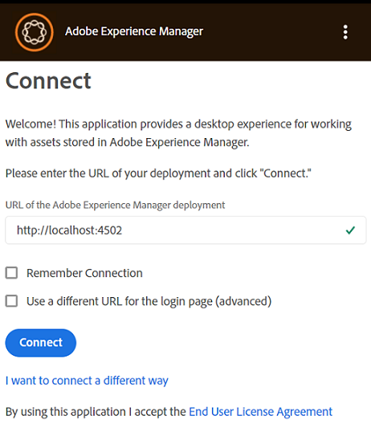
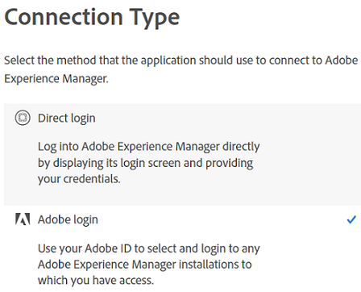
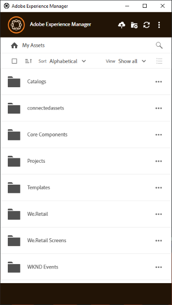

# Installieren des [!DNL Adobe Experience Manager]-Desktop-Programms {#install-app-v2}

Mithilfe des [!DNL Adobe Experience Manager]-Desktop-Programms können Sie über Ihren lokalen Desktop problemlos auf die Assets in [!DNL Experience Manager] zugreifen und sie in beliebigen nativen Desktop-Programmen verwenden. Assets können als Vorschau angezeigt, in nativen Desktop-Programmen geöffnet, in Mac Finder oder Windows Explorer zur Platzierung in anderen Dokumenten angezeigt und lokal geändert werden. Die Änderungen werden beim Upload dann wieder unter einer neuen, im Repository erstellten Version in [!DNL Experience Manager] gespeichert.

Eine solche Integration bietet verschiedenen Rollen in der Organisation folgende Möglichkeiten:

* Assets zentral in [!DNL Experience Manager Assets] verwalten.

* Auf die Assets in allen nativen Desktop-Programmen zugreifen, einschließlich Programmen von Drittanbietern und in Adobe Creative Cloud. Dabei können die Benutzerverschiedene Standards – auch für Branding – problemlos einhalten.

Wenn Sie das [!DNL Experience Manager]-Desktop-Programm verwenden möchten:

* Stellen Sie sicher, dass Ihre [!DNL Experience Manager]-Version vom [!DNL Experience Manager]-Desktop-Programm unterstützt wird. Weitere Informationen finden Sie in den [Systemanforderungen](release-notes.md).

* Laden Sie das Programm herunter und installieren Sie es. Siehe [Installieren des Desktop-Programms](#install-v2) unten.

* Testen Sie die Verbindung mithilfe einiger Assets. Erfahren Sie, [wie Sie Assets durchsuchen und suchen](using.md#browse-search-preview-assets).

## Systemanforderungen, Voraussetzungen und Download-Links {#tech-specs-v2}

Detaillierte Informationen finden Sie in den Versionshinweisen zum [[!DNL Experience Manager] -Desktop-Programm](release-notes.md).

## Upgrade von einer früheren Version {#upgrade-from-previous-version}

Wenn Sie bereits Version 1.x des Desktop-Programms benutzen, sollten Sie die Unterschiede und Ähnlichkeiten zwischen der vorherigen und der aktuellen Version des Programms kennen. Siehe [Neue Funktionen im Desktop-Programm](introduction.md#whats-new-v2) und [Funktionsweise des Programms](release-notes.md#how-app-works).

>[!NOTE]
>
>Auf einem Computer können nicht zwei Versionen des Desktop-Programms gleichzeitig installiert sein. Deinstallieren Sie vor der Installation einer Version die andere Version.

Gehen Sie wie folgt vor, um von einer früheren Version des Programms zu aktualisieren:

1. Synchronisieren Sie vor dem Upgrade alle Assets und laden Sie Ihre Änderungen in [!DNL Experience Manager] hoch. Dadurch soll vermieden werden, dass Änderungen beim Deinstallieren des Programms verloren gehen.

1. Deinstallieren Sie die vorherige Version des Programms. Wählen Sie bei der Deinstallation die Option zum Löschen des Cache.

1. Starten Sie den Computer neu.

1. [Laden Sie die neueste Version des Programms herunter](release-notes.md) und [installieren Sie sie](#install-v2). Befolgen Sie die unten stehenden Anweisungen.

## Installieren {#install-v2}

Gehen Sie wie folgt vor, um das Desktop-Programm zu installieren. Deinstallieren Sie ein eventuell vorhandenes Adobe [!DNL Experience Manager]-Desktop-Programm v1.x, bevor Sie die neueste Version des Programms installieren. Weitere Informationen finden Sie oben.

1. Laden Sie das neueste Installationsprogramm von der Seite mit den [Versionshinweisen](release-notes.md) herunter.

1. Halten Sie die URL und die Anmeldeinformationen Ihrer [!DNL Experience Manager]-Bereitstellung bereit.

1. Wenn Sie ein Upgrade von einer anderen Version des Programms durchführen, finden Sie weitere Informationen unter [Aktualisieren des Desktop-Programms](#upgrade-from-previous-version).

1. Überspringen Sie diesen Schritt, wenn Sie [!DNL Experience Manager] as a [!DNL Cloud Service], [!DNL Experience Manager] 6.4.4 oder neuer, oder [!DNL Experience Manager] 6.5.0 oder neuer verwenden. Stellen Sie sicher, dass Ihr [!DNL Experience Manager]-Setup die in den [Versionshinweisen](release-notes.md) erwähnten Kompatibilitätsanforderungen erfüllt. Falls notwendig, laden Sie das passende [Kompatibilitätspaket](https://experience.adobe.com/#/downloads/content/software-distribution/en/aem.html?package=/content/software-distribution/en/details.html/content/dam/aem/public/adobe/packages/cq640/featurepack/adobe-asset-link-support) herunter und installieren Sie es unter Verwendung von [!DNL Experience Manager] Package Manager als [!DNL Experience Manager]-Administrator. Weitere Informationen zur Installation eines Pakets finden Sie unter [Arbeiten mit Paketen](https://experienceleague.adobe.com/docs/experience-manager-65/administering/contentmanagement/package-manager.html?lang=de).

1. Führen Sie die Binärdatei des Installationsprogramms aus und befolgen Sie die Anweisungen auf dem Bildschirm, um die Installation durchzuführen.

1. Unter Windows werden Sie vom Installationsprogramm möglicherweise zur Installation von `Visual Studio C++ Redistributable 2015` aufgefordert. Folgen Sie den Anweisungen auf dem Bildschirm, um es zu installieren. Wenn die Installation fehlschlägt, installieren Sie es manuell. Laden Sie das Installationsprogramm [hier](https://www.microsoft.com/de-de/download/details.aspx?id=52685) herunter und installieren Sie die Dateien `vc_redist.x64.exe` und `vc_redist.x86.exe`. Führen Sie das Installationsprogramm für das [!DNL Experience Manager]-Desktop-Programm erneut aus.

1. Starten Sie den Computer nach Aufforderung neu. Starten und konfigurieren Sie das Desktop-Programm.

1. Um das Programm mit einem [!DNL Experience Manager]-Repository zu verbinden, klicken Sie auf das Programmsymbol in der Ablage und starten Sie das Programm. Geben Sie die Adresse des [!DNL Experience Manager]-Servers in folgendem Format ein: `https://[aem_server]:[port]/`.

   Klicken Sie auf **[!UICONTROL Connect]** und geben Sie die Anmeldeinformationen ein.

   

   *Abbildung: Verbindungsbildschirm zur Eingabe der Server-Adresse.*

   Wählen Sie **[!UICONTROL Remember Connection]** aus, damit Sie nicht bei jeder Anmeldung bei der Desktop-Anwendung die Verbindungsdetails eingeben müssen.

   >[!CAUTION]
   >
   >Stellen Sie sicher, dass vor oder nach der Adresse des [!DNL Experience Manager]-Servers keine führenden oder nachfolgenden Leerzeichen vorhanden sind. Andernfalls kann das Programm keine Verbindung zum [!DNL Experience Manager]-Server herstellen.

1. [Optional] Klicken **[!UICONTROL I want to connect a different way]** und klicken Sie auf **[!UICONTROL Adobe login]** , um sich mit Adobe Identity Management Service (IMS) beim Experience Manager Assets-Server anzumelden. Mit der IMS-Anmeldung kann die Desktop App automatisch das Zugriffstoken aktualisieren, sodass der Benutzer bis zu 14 Tage lang angemeldet bleiben kann. Klicken **[!UICONTROL Direct login]** , um die Standardanmeldung bei der [!DNL Experience Manager] -Server mit den Anmeldedaten des Benutzers.

   

1. Nach erfolgreicher Verbindung können Sie die Liste der Ordner und Assets anzeigen, die im Stammordner des [!DNL Experience Manager]-DAM verfügbar sind. Sie können die Ordner im Programm durchsuchen.

   

   *Abbildung: Das Programm zeigt nach der Anmeldung den DAM-Inhalt an*

1. ([!DNL Experience Manager] 6.5.1 oder höher) Wenn Sie das Desktop-Programm mit [!DNL Experience Manager] 6.5.1 oder höher verwenden, aktualisieren Sie den S3- oder Azure-Connector auf Version 1.10.4 oder höher. Siehe [Azure-Connector](https://experienceleague.adobe.com/docs/experience-manager-65/deploying/deploying/data-store-config.html?lang=de#azure-data-store) oder [S3-Connector](https://experienceleague.adobe.com/docs/experience-manager-65/deploying/deploying/data-store-config.html?lang=de#amazon-s-data-store).

   Wenn Sie Adobe Managed Services (AMS)-Kunde sind, wenden Sie sich an den Adobe-Support.

## Festlegen von Voreinstellungen {#set-preferences}

Um die Voreinstellungen zu ändern, klicken Sie auf das Symbol  und auf das Symbol **[!UICONTROL Preference]** . Passen Sie die Werte im Fenster **[!UICONTROL Preferences]** wie folgt an:

* [!UICONTROL Launch application on login].

* [!UICONTROL Show window when application starts].

* **[!UICONTROL Cache Directory]**: Speicherort des lokalen Cache des Programms (enthält die lokal heruntergeladenen Assets).

* **[!UICONTROL Network Drive Letter]**: Der Laufwerksbuchstabe, der für die Zuordnung zum [!DNL Experience Manager]-DAM verwendet wird. Ändern Sie diesen Wert nur, wenn Sie sich absolut sicher sind. Das Programm kann jedem Laufwerksbuchstaben unter Windows zugeordnet werden. Wenn zwei Benutzer Assets aus unterschiedlichen Laufwerksbuchstaben platzieren, können sie die Assets des jeweils anderen nicht sehen. Der Pfad der Assets ändert sich. Die Assets bleiben in der Binärdatei (z. B. INDD) und werden nicht entfernt. Das Programm listet alle verfügbaren Laufwerksbuchstaben auf und verwendet standardmäßig den letzten verfügbaren Buchstaben, also meist `Z`.

* **[!UICONTROL Maximum Cache Size]**: Zulässiger Cache auf der Festplatte in GB zum Speichern lokal heruntergeladener Assets.

* **[!UICONTROL Current cache size]**: Speichergröße der lokal heruntergeladenen Assets. Die Informationen werden erst angezeigt, nachdem Assets mit dem Programm heruntergeladen wurden.

* **[!UICONTROL Automatically download linked assets]**: Die Assets, die in den unterstützten nativen Creative Cloud-Programmen platziert wurden, werden automatisch abgerufen, wenn Sie die Originaldatei herunterladen.

* **[!UICONTROL Maximum number of downloads]**:  Mit Vorsicht ändern. Beim erstmaligen Herunterladen von Assets (über die Option „Anzeigen“, „Öffnen“, „Bearbeiten“, „Herunterladen“ usw.) werden die Assets nur heruntergeladen, wenn der Stapel weniger als diese Anzahl enthält. Der Standardwert ist 50. Ändern Sie sie nicht, wenn Sie sich nicht sicher sind. Eine Erhöhung des Werts kann zu längeren Wartezeiten führen und eine Verringerung des Werts verhindert womöglich, dass Sie die erforderlichen Assets oder Ordner in einem Schritt herunterladen können.

* **[!UICONTROL Use legacy conventions when creating nodes for assets and folders]**:  Mit Vorsicht ändern. Mit dieser Einstellung kann das Programm das Programmverhalten der Version 1.10 beim Hochladen von Ordnern emulieren. In Version 1.10 berücksichtigen die im Repository erstellten Knotennamen die Leerzeichen und die Groß-/Kleinschreibung der vom Benutzer angegebenen Ordnernamen. In Version 2.1 des Programms werden die zusätzlichen Leerzeichen in den Ordnernamen jedoch in Bindestriche umgewandelt. Wenn Sie beispielsweise `New Folder` oder `new   folder` hochladen, wird derselbe Knoten im Repository erstellt, wenn die Option nicht ausgewählt ist und das Standardverhalten in Version 2.1 beibehalten wird. Wenn diese Option aktiviert ist, werden im Repository für die beiden oben genannten Ordner unterschiedliche Knoten erstellt, was dem Verhalten der Version 1.10 des Programms entspricht.

  Das Standardverhalten von Version 2.1 bleibt weiterhin erhalten, d. h. mehrere Leerzeichen in Ordnernamen werden durch einen Bindestrich im Repository-Knotennamen ersetzt und die Knotennamen werden in Kleinbuchstaben umgewandelt.

* **[!UICONTROL Upload Acceleration]**:  Mit Vorsicht ändern. Beim Hochladen von Assets kann das Programm gleichzeitige Uploads verwenden, um die Upload-Geschwindigkeit zu steigern. Sie können die Zahl der gleichzeitigen Uploads erhöhen, indem Sie den Schieberegler nach rechts verschieben. Wenn sich der Schieberegler ganz links befindet, finden keine gleichzeitigen Uploads statt (Upload mit nur einem Thread), die mittlere Position entspricht 10 parallelen Threads, die Position ganz rechts entspricht 20 parallelen Threads. Eine höhere Parallelitätsgrenze ist ressourcenintensiver.

Um die nicht verfügbaren Voreinstellungen zu aktualisieren, melden Sie sich beim [!DNL Experience Manager]-Server ab und aktualisieren Sie anschließend. Klicken Sie nach dem Aktualisieren der Voreinstellungen auf .


*Abbildung: Voreinstellungen für das Desktop-Programm.*

### Proxy-Unterstützung {#proxy-support}

Das [!DNL Experience Manager]-Desktop-Programm verwendet den vordefinierten Proxy des Systems, um über HTTPS eine Internet-Verbindung herzustellen. Das Programm kann die Verbindung nur mit einem Netzwerk-Proxy herstellen, für den keine gesonderte Authentifizierung erforderlich ist.

Wenn Sie Proxy-Server-Einstellungen für Windows konfigurieren oder ändern (Internetoptionen > LAN-Einstellungen), starten Sie das [!DNL Experience Manager]-Desktop-Programm neu, damit die Änderungen wirksam werden. Die Proxy-Konfiguration wird angewendet, wenn Sie das Desktop-Programm starten. Schließen Sie das Programm und starten Sie es erneut, damit Änderungen wirksam werden.

Wenn für den Proxy eine Authentifizierung erforderlich ist, kann die IT-Abteilung die URL von [!DNL Experience Manager Assets] in den Proxy-Server-Einstellungen zulassen, um den Programm-Traffic durchzulassen.

## Deinstallieren des Programms {#uninstall-the-app}

Gehen Sie wie folgt vor, um das Programm unter Windows zu deinstallieren:

1. Laden Sie alle Änderungen in [!DNL Experience Manager] hoch, um den Verlust von Änderungen zu vermeiden. Siehe [Bearbeiten von Assets und Hochladen aktualisierter Assets in [!DNL Experience Manager]](using.md#edit-assets-upload-updated-assets). Melden Sie sich ab und beenden ([!UICONTROL Exit]) Sie das Programm.

1. Entfernen Sie die Anwendung so, wie Sie auch jede andere Anwendung im Betriebssystem entfernen würden. Deinstallieren Sie sie unter Windows über „Programme hinzufügen und entfernen“.

1. Um den Cache und die Protokolle zu entfernen, aktivieren Sie das entsprechende Kontrollkästchen.

   

1. Folgen Sie den angezeigten Anweisungen. Starten Sie nach Abschluss des Vorgangs den Computer neu.

Gehen Sie wie folgt vor, um das Programm auf einem Mac zu deinstallieren:

1. Laden Sie alle Änderungen in [!DNL Experience Manager] hoch, um den Verlust von Änderungen zu vermeiden. Siehe [Bearbeiten von Assets und Hochladen aktualisierter Assets in [!DNL Experience Manager]](using.md#edit-assets-upload-updated-assets). Melden Sie sich ab und beenden ([!UICONTROL Exit]) Sie das Programm.

1. Entfernen Sie `Adobe Experience Manager Desktop.app` aus `/Applications`.

Alternativ können Sie unter Mac OS den folgenden Befehl im Terminal ausführen, um interne Programm-Caches zu löschen und das Programm zu deinstallieren:

```shell
/Applications/Adobe Experience Manager Desktop/Contents/Resources/uninstall-osx/uninstall.sh
```
